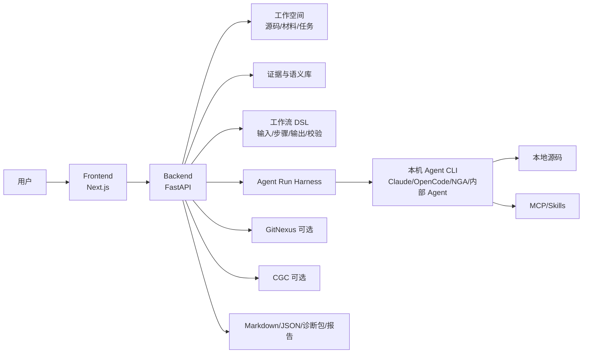

# CodeTalk

CodeTalk 是一个面向代码理解、测试分析和智能体编排的本地 Web 工作台。它把工作空间、源码索引、AI 线程、Agent 运行、MCP/Skills、语义证据库、覆盖率分析和可下载报告放在同一套产品体验里，让研发、测试和架构团队可以围绕真实代码完成分析、设计、审计和交付。

当前版本已经不再是早期的 Wiki 生成工具。CodeTalk 的核心目标是：

- 让 AI 默认基于用户选择的工作空间、源码文件、输入材料和历史证据回答问题。
- 让 Agent 的命令行执行过程可追踪，但默认只展示用户真正需要看的结论、进度、失败原因和产物。
- 让测试相关活动形成可复用工作流：代码分析 -> 流程梳理 -> SFMEA -> 黑盒测试用例 -> 报告导出。
- 让黑盒测试人员不用写 JSON，也能通过工作流设计器和运行驾驶舱组织输入、MCP、Skills、Agent、校验和输出。

默认本地端口：

| 服务 | 默认地址 |
|---|---|
| Frontend | `http://127.0.0.1:3003` |
| Backend API | `http://127.0.0.1:3004` |
| Deployer | `http://127.0.0.1:9000` |

## 目录

- [适合谁使用](#适合谁使用)
- [功能总览](#功能总览)
- [产品页面](#产品页面)
- [架构边界](#架构边界)
- [快速开始](#快速开始)
- [手动开发启动](#手动开发启动)
- [第一次正确使用](#第一次正确使用)
- [工作空间](#工作空间)
- [AI 线程](#ai-线程)
- [智能体编排](#智能体编排)
- [Workbench V2 使用手册](docs/WORKBENCH_V2_USER_GUIDE.md)
- [推荐测试工作流](#推荐测试工作流)
- [覆盖率分析](#覆盖率分析)
- [模型、Agent、MCP 与 Skills](#模型agentmcp-与-skills)
- [产物与证据契约](#产物与证据契约)
- [测试活动产品化基线](#测试活动产品化基线)
- [安全与隐私](#安全与隐私)
- [测试与质量验证](#测试与质量验证)
- [常见问题](#常见问题)
- [项目结构](#项目结构)

## 适合谁使用

CodeTalk 适合这些团队和场景：

| 角色 | 典型用途 |
|---|---|
| 测试工程师 | 从代码、MR、需求、覆盖率和历史缺陷生成测试策略、SFMEA、黑盒用例和回归清单 |
| 研发工程师 | 梳理模块边界、调用链、异常路径、资源释放、补丁影响面 |
| 架构师 | 评审关键流程、证据引用、风险项和跨模块影响 |
| 新成员 | 通过工作空间和 AI 线程快速理解陌生仓库 |
| 团队管理员 | 统一配置模型、Agent 执行器、GitNexus、CGC、MCP 和本地运行方式 |

你不需要手动调用后端 API，也不需要理解内部 DSL 才能使用。正常路径是从浏览器进入 CodeTalk，通过工作空间、AI 线程和运行驾驶舱完成任务。

## 功能总览

### 源码优先的 AI 线程

- 选择工作空间后，AI 默认优先读取工作空间源码、输入文件、历史产物和语义证据。
- 除非用户明确要求“不要基于源码”，否则回答应先查本地源码和可用的 GitNexus/CGC 产物。
- 支持多轮追问、上下文延续、长对话独立滚动、Agent 思考过程默认折叠。
- 生成过程中不会把用户正在阅读的历史消息强制拉回底部。

### 智能体编排

- 运行驾驶舱：选择工作空间和工作流，填写输入，启动真实 Agent 任务，查看右侧状态、失败原因、产物和下载入口。
- 工作流设计：用节点表达输入、MR、文件、Agent、MCP、Skills、校验和输出，JSON 仅作为高级模式。
- 语义与证据：管理 semantic case、历史证据、source slice 和可复用测试知识。
- 内置测试工作流覆盖代码分析、流程梳理、SFMEA、黑盒测试、资源泄漏排查、补丁影响评审、覆盖率缺口和可靠性测试。

### Agent 运行体验

- 支持 Claude Code Router、Claude Code、OpenCode、NGA、内部 Agent CLI 等本机执行器。
- CodeTalk 捕获 stdout、stderr、退出码、raw output、诊断信息和结构化产物。
- 用户默认看到清洗后的回答、运行进度、错误摘要、验收审计和可下载文件。
- Agent 初始化文字、命令行噪声和内部思考过程默认折叠，避免污染最终回答。

### 测试活动支持

CodeTalk 不只生成测试用例，还支持完整测试活动：

- 测试策略和范围定义
- 需求、设计、MR、源码和覆盖率输入
- 入口发现和代码流程梳理
- SFMEA 风险分析
- 黑盒测试用例生成
- 回归测试矩阵
- 性能、可靠性、恢复、并发、资源不足和异常场景设计
- 缺陷分诊与重测建议
- 覆盖率缺口分析
- 可下载 Markdown/JSON 报告

## 产品页面

| 页面 | 路径 | 用途 |
|---|---|---|
| 工作台 | `/` | 进入主要功能、查看当前系统状态 |
| 工作空间 | `/workspaces` | 创建和管理源码工作空间 |
| 工作空间详情 | `/workspaces/:id` | 查看索引、材料、报告、任务和源码上下文 |
| AI 线程 | `/ai` | 围绕工作空间发起对话式 Agent 任务 |
| AI 线程详情 | `/ai/:id` | 查看单个线程的消息、产物和折叠诊断 |
| 任务中心 | `/tasks` | 管理 Task、筛选状态并查看多次 Run Attempt |
| 新建任务 | `/tasks/new` | 选择已发布工作流并完成六步任务向导 |
| 运行驾驶舱 | `/tasks/:taskId/runs/:runId` | 查看一次真实 Attempt 的进度、输出、质量和交付件 |
| 工作流库 | `/workflows` | 管理工作流、草稿、发布版本和归档状态 |
| 新建工作流 | `/workflows/new` | 用六步向导定义输入、Agent、Skills、MCP、输出和 DAG |
| 测试语义库 | `/semantic-library` | 浏览、筛选、编辑、导入、废弃和恢复 semantic case |
| 证据库 | `/evidence-library` | 检索 Evidence Memory、来源、source slice 和运行引用 |
| 覆盖率分析 | `/coverage` | 导入覆盖率或测试数据，分析缺口 |
| 设置 | `/settings` | 配置模型、Agent、执行器、工具健康检查 |

Workbench V2 默认启用。旧 `/workbench`、`/workbench/designer` 和
`/workbench/semantic` 分别跳转到任务、工作流和语义库；设置
`WORKBENCH_V2_ENABLED=false` 并重启后端可在一个发布周期内恢复旧入口。
旧 API、旧运行目录和旧产物仍按原位置读取。

## 架构边界

CodeTalk 的设计原则是：CodeTalk 负责确定性控制、证据管理和用户体验，外部 Agent 负责有凭据的源码探索和推理。



关键边界：

- CodeTalk 不直接信任 Agent 的自然语言结论。
- Agent 输出只有通过路径、证据、schema、artifact 和验收审计后，才成为可展示结果。
- GitNexus 和 CGC 是增强证据来源，不是唯一真相。
- 如果增强组件不可用，系统应降级到本地源码、输入文件、语义库和 Agent 搜索。

## 快速开始

### 1. 启动部署器

Windows:

```powershell
cd deployer
.\start.bat
```

macOS/Linux:

```bash
cd deployer
./start.sh
```

浏览器打开：

```text
http://127.0.0.1:9000
```

部署器会检查 Python、Node.js、Git、端口、后端依赖、前端依赖、可选 GitNexus/CGC 和配置文件。

### 2. 启动 CodeTalk

在部署器中点击 `Start All`。确认：

- Backend 已运行
- Frontend 已运行
- 健康检查通过

然后打开：

```text
http://127.0.0.1:3003
```

大仓库或长时间 Agent 任务建议在部署向导的“临时文件目录”中选择空间充足的数据盘。例如工作目录使用 `/Volumes/Media/codetalk-runtime` 时，向导会自动填写 `/Volumes/Media/codetalk-runtime/tmp`。该设置会同时作用于后端、前端、Agent 子进程、GitNexus、CGC 和 Playwright；任务结束后，Agent 的隔离运行目录会自动清理。

### 3. 验证后端

```bash
curl http://127.0.0.1:3004/health
```

正常返回类似：

```json
{"status":"ok"}
```

## 手动开发启动

如果你是开发者，也可以绕过部署器手动启动。

### 后端

```bash
cd backend
python3.11 -m venv .venv311
source .venv311/bin/activate
pip install -r requirements.txt
export CODETALK_TEMP_DIR=/Volumes/Media/codetalk-runtime/tmp
uvicorn app.main:app --host 0.0.0.0 --port 3004 --reload
```

### 前端

```bash
cd frontend
npm install
CODETALK_TEMP_DIR=/Volumes/Media/codetalk-runtime/tmp \
NEXT_PUBLIC_API_URL=http://localhost:3004 npm run dev
```

打开：

```text
http://127.0.0.1:3003
```

## 第一次正确使用

建议按下面顺序完成第一次成功体验：

1. 启动 backend + frontend。
2. 进入“设置”，配置一个可用模型。
3. 进入“工作空间”，创建一个真实源码仓库工作空间。
4. 等待索引完成，确认可以浏览和搜索文件。
5. 进入“AI 线程”，选择工作空间，问一个具体代码问题。
6. 进入“工作流”，选择一个已发布版本；需要定制时从模板创建草稿、验证并发布。
7. 进入“任务中心”，点击“新建任务”，选择工作流版本和工作空间。
8. 按工作流定义填写目标模块、输入文件、MR 链接或测试约束；默认继承执行器、Skills、MCP 和输出。
9. 保存并运行，在专属运行驾驶舱观察节点、公开 Agent 输出、质量状态、失败原因和交付件。
10. 预览或下载 Markdown/JSON artifact；诊断、原始事件和技术文件默认折叠。

对于 SPDK 这类大仓库，可先创建：

```text
/Volumes/Media/dpdk/spdk
```

然后从较小目标开始，例如：

```text
lib/nvmf
lib/iscsi
lib/bdev
test/nvmf
test/iscsi_tgt
```

## 工作空间

工作空间是 CodeTalk 的核心上下文。AI 线程、运行驾驶舱、覆盖率分析和语义证据都应绑定到工作空间。

### 创建工作空间

1. 打开“工作空间”。
2. 点击“新建工作空间”。
3. 输入名称。
4. 选择或输入真实本地仓库路径。
5. 提交并等待索引。

示例：

```text
/Volumes/Media/dpdk/spdk
```

如果路径不存在，例如少写了 `e`：

```text
/Volums/Media/dpdk/spdk
```

页面应明确提示路径不存在，而不是静默失败。

### 工作空间最佳实践

- 一个仓库只建一个主工作空间，避免重复上下文。
- 大仓库先从模块级目标开始，不要一开始让 Agent 分析整个仓库。
- 把需求、设计、MR 描述、覆盖率、历史缺陷等材料作为输入文件或 semantic case 管理。
- 运行驾驶舱中不要重复手输仓库路径，应优先选择已创建工作空间。

## AI 线程

AI 线程是对话式 Agent 入口，适合快速询问、追问、澄清和基于源码继续分析。

### 适合的问题

```text
分析 SPDK NVMe-oF target connect 到 IO 提交流程，列出关键文件和外部可观测行为。
```

```text
基于当前工作空间，梳理 iSCSI login 的认证失败、digest、多连接和 session reset 风险。
```

```text
只从黑盒测试角度输出可执行测试用例，不要要求测试者调用内部函数。
```

### AI 线程的显示规则

- 用户消息和最终回答是主内容。
- Agent 初始化、命令行噪声、raw output、长日志和内部推理默认折叠。
- 如果任务运行中，页面显示进度、当前阶段和可展开诊断。
- 如果失败，显示中文失败原因、重试建议和诊断包入口。
- 长对话区域独立滚动，用户向上阅读时不应被新 token 强制拉回底部。

### 如何得到更好结果

尽量给出：

- 工作空间
- 目标模块或路径
- 关注流程
- 输入文件或 MR 链接
- 输出格式
- 测试视角限制

示例：

```text
工作空间使用 SPDK。目标 lib/iscsi。
请分析 iSCSI login 到 full feature phase 的主流程和异常流程。
输出四部分：代码证据、流程步骤、SFMEA、黑盒测试用例。
黑盒用例只能包含外部输入、操作、预期结果、日志/指标/状态观测点。
```

## 智能体编排

Workbench V2 把“怎么执行”和“这次要做什么”分开，形成四个互相联动的产品域：

```text
工作流库：定义并发布执行方法
  -> 任务中心：选择固定版本，填写本次输入和可选覆盖
    -> Run Attempt：冻结工作流、输入、覆盖和编译计划
      -> 运行驾驶舱：展示真实节点、事件、质量和交付件
        -> 语义库 / 证据库：沉淀可复用测试资产
```

### 工作流库与设计

工作流设计用于创建或调整“以后如何执行”。模板只初始化草稿，画布是唯一可写事实源；发布版本不可原地修改，后续变更必须从已发布版本创建新草稿。

节点类型包括：

| 节点 | 用户视角 |
|---|---|
| 输入 | 命名一个输入，例如“需求文档”“设计说明”“MR 链接”“覆盖率文件” |
| Agent | 选择执行器、模型、源码优先策略、MCP 和 Skills |
| 语义/证据检索 | 在执行前读取可复用测试知识和代码证据 |
| 本地范围发现 | 从工作空间定位目标模块与可读源码 |
| 校验 | 检查证据真实性、schema、artifact 和质量门禁 |
| 输出 | 命名要生成的报告或文件，例如 `sfmea.json`、`black_box_cases.md` |

Agent 节点的 Provider 来自设置页能力发现，Skills 和 MCP 以可搜索选择器配置；工作流 JSON 只用于只读诊断或专家导入导出。

### 任务中心与六步向导

任务描述“这次要完成什么”。用户选择一个已发布工作流和一个已创建工作空间，然后按命名输入契约上传文件、填写 MR 链接或目标文本。普通用户直接继承工作流的 Agent、Skills、MCP 和输出；高级用户只覆盖本次需要变化的节点或增加任务专用输出。

一个 Task 可以产生多次 Run Attempt。重试会创建 Attempt N+1，并复用原 Attempt 冻结的工作流版本、输入快照和成功上游产物，不覆盖历史结果。

### 运行驾驶舱

驾驶舱只观察一次 Attempt，不再混入工作流编辑表单。首屏依次展示：

- 执行、质量、交付三个独立状态，以及当前节点和 Attempt 关系。
- 节点级真实进度、公开 Agent 输出和工具调用；实时事件通过增量 SSE 到达。
- 中文失败原因、是否可重试及“从失败节点重试”操作。
- 最终交付件的预览和下载；输入、支持文件、原始事件和诊断默认折叠。

当用户向上查看历史输出时自动跟随会暂停，不会被新事件强制拉回底部。前端最多保留 2,000 条已加载事件，更老事件按页读取。

### 语义库与证据库

语义与证据页用于沉淀可复用测试知识：

- semantic case
- 历史风险项
- source slice
- evidence card
- 运行产物
- 高价值测试场景

语义用例支持预览后导入、字段映射、冲突策略、编辑、废弃和恢复；证据库直接读取现有 Evidence Memory 与 source slice。两者与工作流输出、AI 检索和运行引用使用同一存储，不维护一份只供 UI 展示的副本。

完整逐步说明、状态含义、失败恢复和验收检查见
[`docs/WORKBENCH_V2_USER_GUIDE.md`](docs/WORKBENCH_V2_USER_GUIDE.md)。

## 内置工作流

常用预设包括：

| 预设 | 用途 |
|---|---|
| `module_analysis` | 模块分析，输出 scope、evidence cards 和报告 |
| `resource_leak_hunt` | 资源释放、错误路径、泄漏和测试 hook 排查 |
| `patch_impact_review` | 输入 patch diff 或 MR 描述，评估影响面和回归范围 |
| `mr_blackbox_test` | 面向 MR 生成黑盒测试用例 |
| `source_flow_sfmea_blackbox` | 代码分析 -> 流程梳理 -> SFMEA -> 黑盒测试用例 |
| `testing_activity_orchestration` | 覆盖完整测试活动：策略、范围、环境、设计、执行、缺陷、回归、报告 |
| `basic_source_report_codex` | 仅输入源码工作空间，由 Codex CLI 生成流程、SFMEA 与黑盒测试报告 |
| `basic_source_design_report_builtin` | 输入源码工作空间和设计文档，由内置模型生成同结构报告 |

正式版默认展示 `source_flow_sfmea_blackbox` 以及上述两个基础验证预设。它们由源码注册，
后端在全新数据目录启动时会自动发布，在已有数据目录升级时也会刷新为当前内置版本；
因此它们不是本机数据库中的临时测试数据。两个基础预设用于对照验证 Agent 与内置模型的
输入传递、源码读取、设计约束吸收和 `report.md` 交付链路，不应在发布清理中删除。

存储和 SPDK 场景还内置了多组测试预设，例如：

| 场景 | 关注点 |
|---|---|
| NVMe-oF connect / IO | connect、认证、queue 建立、IO 提交、disconnect、reconnect |
| iSCSI login/session | login、CHAP、digest、多连接、认证失败、session reset |
| bdev IO/reset/failover | open、submit、complete、reset、I/O drain、failover |
| blobstore/FTL recovery | metadata 恢复、空间不足、异常关闭 |
| vhost/vfio-user lifecycle | device lifecycle、queue 配置、guest detach |
| reactor/thread/poller | 跨线程消息、poller 阻塞、长任务调度 |
| RPC/config | 非法参数、重复调用、顺序错误、部分成功回滚 |
| 性能与可靠性 | queue depth、backpressure、长稳、资源泄漏、网络分区 |

## 推荐测试工作流

### 代码分析 -> 流程梳理 -> SFMEA -> 黑盒用例

这是当前最重要的端到端工作流。

1. 创建工作空间。
2. 在“工作流”中选择并确认 `source_flow_sfmea_blackbox` 已发布；需要定制时从它创建草稿。
3. 打开“任务中心”，点击“新建任务”。
4. 选择该已发布工作流和工作空间。
5. 按命名输入填写目标模块，例如：

```text
lib/iscsi
```

6. 按需添加输入：

| 输入名称 | 示例 |
|---|---|
| 需求说明 | `docs/iscsi-login-requirements.md` |
| 设计说明 | `docs/iscsi-session-design.md` |
| MR 链接 | `https://git.example.com/group/repo/merge_requests/123` |
| Patch | 本地 diff 文件或粘贴的 diff 文本 |
| 覆盖率 | lcov、gcov、pytest coverage 或团队格式 |
| 历史缺陷 | defect list、issue 链接、事故复盘 |

7. 默认继承工作流的 Agent、Skills 和 MCP；本次确有差异时再进入高级覆盖：

| 配置 | 推荐 |
|---|---|
| Agent | Claude Code Router、Claude Code、OpenCode 或内部 Agent |
| MCP | GitNexus + CGC 可用时启用，不可用时自动降级 |
| Skills | 源码证据优先、SFMEA、黑盒测试设计、产物契约、覆盖率缺口分析 |
| 源码优先 | 默认开启 |

8. 在第六步检查冻结摘要并点击“保存并运行”。
9. 在该 Attempt 的运行驾驶舱检查：

| 区域 | 应看到 |
|---|---|
| 状态 | 空、运行中、失败、已完成 |
| 当前阶段 | 输入解析、源码检索、流程梳理、SFMEA、用例生成、校验、产物落盘 |
| 失败原因 | 中文摘要、可行动建议、诊断包入口 |
| 运行产物 | Markdown/JSON 文件、报告、审计结果 |
| 验收审计 | 哪些输出通过、哪些缺失或不合格 |

10. 打开并下载产物。

一个合格结果至少应包含：

- 代码证据：真实文件、函数、行附近片段或 source slice。
- 流程步骤：主流程、异常流程、恢复路径、并发和边界。
- SFMEA：failure mode、cause、effect、detection、S/O/D 评分、RPN、mitigation。
- 黑盒测试用例：前置条件、外部操作、预期结果、观测点、失败诊断线索。

### 测试活动编排

当你需要完整测试活动，而不是单次测试设计时，使用 `testing_activity_orchestration`。

适合输入：

- 需求文档
- 设计文档
- MR 链接
- 覆盖率报告
- 历史缺陷
- 目标模块
- 测试环境约束
- 发布风险说明

适合输出：

- 测试策略
- 测试范围和风险
- 环境准备清单
- 测试设计矩阵
- 覆盖率缺口报告
- 缺陷分诊建议
- 回归测试清单
- 发布准入/退出标准
- 可下载总报告

## 覆盖率分析

覆盖率分析用于把测试数据和源码入口关联起来。

它可以帮助你回答：

- 哪些入口被覆盖？
- 哪些入口覆盖率低？
- 哪些场景适合黑盒测试？
- 哪些场景必须引入灰盒或白盒观测？
- 哪些模块需要补充测试？

使用方式：

1. 打开“覆盖率分析”。
2. 选择工作空间。
3. 上传覆盖率或测试数据。
4. 运行分析。
5. 查看 entry discovery、black-box readiness、gray-box required、补充测试建议。
6. 将结果作为工作流输入继续生成测试设计。

## 模型、Agent、MCP 与 Skills

### 模型配置

在“设置”中配置模型。

常见模式：

| 类型 | 配置 |
|---|---|
| OpenAI compatible | Base URL、API Key、模型名 |
| Anthropic | API Key、模型名 |
| Google | API Key、模型名 |
| Ollama | 本地 `OLLAMA_BASE_URL` 和模型名 |

环境变量示例：

```bash
OPENAI_API_KEY=<your-api-key>
ANTHROPIC_API_KEY=<your-anthropic-key>
GOOGLE_API_KEY=<your-google-key>
OLLAMA_BASE_URL=http://localhost:11434
```

不要把真实密钥提交到 Git，也不要把完整密钥粘贴到 issue、日志或报告。

### Agent 执行器

CodeTalk 可以调用本机 Agent CLI。常见配置：

```bash
CLAUDE_CODE_COMMAND="ccr code -p --output-format json"
CLAUDE_CODE_FALLBACK_COMMANDS="claude -p --output-format json"
OPENCODE_COMMAND="opencode"
OPENCODE_FALLBACK_COMMANDS=""
```

如果后端由部署器、服务、IDE 或任务系统拉起，建议使用 Agent 命令的绝对路径，避免 PATH 不一致。

### MCP

MCP 能力应该通过 Agent 能力发现和设置页探测得到，而不是让用户手写隐藏配置。

用户视角只需要选择：

- 无
- GitNexus
- CGC
- GitNexus + CGC
- Agent 自带 MCP profile

如果某个 Agent 有大量 MCP，界面应支持搜索、分组、最近使用和能力摘要，不应一次性把所有选项堆满页面。

### Skills

Skills 是对 Agent 行为的约束和能力提示。常用 Skills：

- 源码证据优先
- SFMEA
- 黑盒测试设计
- 产物契约
- 测试策略与计划
- 覆盖率与缺口分析
- 测试执行编排
- 缺陷分诊与回归
- 性能与可靠性测试

普通用户通过下拉、多选和模板选择 Skills；高级用户可以查看最终生成的 workflow JSON。

## 产物与证据契约

CodeTalk 推荐把大结果写成文件，而不是全部堆在聊天框或终端输出里。

当用户请求测试策略、测试设计、SFMEA、黑盒测试用例、模块地图、源码定向阅读或测试视角代码理解时，系统会生成 `TestActivityContract`。它把测试目标、领域画像、项目画像、证据策略、黑盒边界、质量门禁和输出模板一起传给 Agent 或内置模型，避免模型自由发挥交付件骨架。

常见产物：

| 产物 | 格式 | 用途 |
|---|---|---|
| `source_scope.json` | JSON | 分析范围、入口、文件和证据 |
| `flow_map.md` | Markdown | 主流程、异常流程、恢复路径 |
| `sfmea.json` | JSON | 结构化 SFMEA 表 |
| `black_box_cases.md` | Markdown | 可交给测试工程师执行的用例 |
| `coverage_gap_report.json` | JSON | 覆盖率缺口和补测建议 |
| `acceptance_audit.json` | JSON | 输出通过/失败项、schema 校验和证据检查 |
| `final_report.md` | Markdown | 总报告 |
| `diagnostics.zip` | 压缩包 | 失败任务的日志摘要、trace、输入和任务 ID |

### 源码驱动测试分析 V2

正式预设 `source_flow_sfmea_blackbox` 不会让模型凭一段提示词自由发挥整份测试设计。系统先读取并校验源码证据，再按依赖关系物化以下工件：

| 阶段 | 关键工件 | 回答的问题 |
|---|---|---|
| 广度盘点 | `entrypoints.json`、`flows.json`、`states.json`、`resources.json`、`model_applicability.json` | 有哪些入口、流程、状态、资源，哪些测试模型确实适用 |
| 开发讲解与处置 | `flow_cards.json`、分支/状态/资源处置台账、`error_propagation_chains.json` | 每条机制如何工作，遗漏项为何保留、合并、阻塞或不适用 |
| 八源场景扩展 | `scenario_candidates.json`、`evidence_consumption_ledger.json` | 分支、状态、资源、边界、并发、异常传播、协议和历史证据产生了哪些候选场景 |
| 测试设计治理 | `risk_register.json`、`test_basis.json`、`test_scenarios.json`、`test_flows.json`、`traceability_matrix.json` | 风险如何映射到可执行黑盒用例和真实证据 |
| 独立门禁 | `independent_fact_verification.json`、`judge_report.json` | 结构、事实、可执行性和覆盖处置是否允许交付 |

资源分析不仅检查内存，还覆盖 cmd、PDU、队列项、连接、session、引用、Bitmap、计数器、Tag/Generation、句柄和配额。只有源码同时给出申请/释放生命周期与明确的池、容量、上限、Bitmap 或计数机制时，才扩展 `0/1/N-1/N/N+1`、`2N-1/2N/2N+1`；只有存在类型、序列、Tag 或 Generation 证据时才扩展上限、回绕和重用场景。普通的 `request`、`connection` 或 `count` 字样不会单独触发容量模型。

SFMEA 与黑盒用例通过稳定 ID 关联。每条用例必须声明 `risk_ids`，高 RPN 风险没有用例映射、事实未核验、资源生命周期未闭合或存在孤立用例时，Coverage Judge 会显示 `PARTIAL` 或 `BLOCKED`，不会用结构分数冒充质量全绿。L1 只负责校验证据路径、符号、引用原文和字面绑定；最终事实通过必须来自独立 L2 行为核验。L2 未运行、非独立或证据不足时不能进入 `READY`。

### 可选测试设计脑图

创建任务时在“输出”步骤勾选“测试设计脑图”即可；未勾选时不会生成，也不会作为缺失交付件告警。该输出只能连接到“内置模型 + 分阶段分析”节点，编译器会拒绝普通外部 Agent 节点，避免把确定性渲染任务错误交给 Agent 自由生成。勾选后系统自动生成：

| 文件 | 用途 |
|---|---|
| `test_design_mindmap.json` | 唯一结构化事实源，保存稳定 ID、状态、优先级、证据和追溯关系 |
| `test_design_mindmap.html` | 可离线打开的交互版本 |
| `test_design_mindmap.svg` | 适合评审、报告和归档的静态版本 |

运行完成后在驾驶舱“交付件”区域点击脑图 JSON，可按标题和摘要搜索，按优先级、节点类型、状态筛选，展开或折叠层级，并查看节点对应的源码证据、Flow、State、Resource、SFMEA 和 Case。预览区域有固定高度和独立滚动，不会把整个页面无限拉长。HTML 与 SVG 由 CodeTalk 的确定性渲染器生成，模型不能自由插入脚本或决定布局；SVG 包含 JSON 中的全部节点，三件套携带同一 `generation_id`，刷新时通过临时文件原子替换。

建议的使用顺序：

1. 创建并完成源码工作空间索引。
2. 新建任务，选择 `source_flow_sfmea_blackbox` 和工作空间。
3. 输入具体分析对象，例如“iSCSI Login 登录、认证、错误恢复和并发连接流程”。
4. 按需上传需求、设计或覆盖率材料；需要可视化评审时勾选“测试设计脑图”。
5. 启动运行，在驾驶舱先看当前阶段，再看四轴质量状态，最后下载交付件。
6. 只有 Coverage Judge 为 `READY` 且事实核验、可执行性和覆盖处置均通过时，才将结果作为正式测试设计交付。

高质量产物要求：

- 引用的文件必须真实存在。
- JSON 输出必须有 schema 或输出模板。
- 黑盒用例不能要求测试者调用内部函数或修改内部代码。
- SFMEA 风险必须能映射到真实源码、测试目录、日志、指标或外部行为。
- 失败时保留诊断信息，但不泄露完整模型密钥或敏感环境变量。

## 测试活动产品化基线

详细设计、内置领域画像、SPDK 项目画像、交付件模板、质量审计规则、内网验收清单和成熟度基线见：

- [`docs/TEST_ACTIVITY_PRODUCTIZATION.md`](docs/TEST_ACTIVITY_PRODUCTIZATION.md)

这份文档也记录了本轮真实浏览器 E2E 验证范围：创建工作空间、GitNexus 索引、工作流设计导入保存、运行驾驶舱填表运行、质量审计、artifact 预览和下载。

## 安全与隐私

CodeTalk 默认运行在本机或内网环境。使用时请注意：

- 不要在 README、issue、截图或日志里暴露完整 API Key。
- 设置页和日志应只展示密钥遮罩。
- 运行产物中不得包含完整密钥、本机敏感环境变量或不必要的凭据。
- Agent 能访问的源码和文件应符合团队权限要求。
- 外部模型是否允许读取内网源码，取决于团队安全策略。

## 测试与质量验证

后端测试：

```bash
cd backend
pytest -q
```

前端检查：

```bash
cd frontend
npm run lint
```

前端 E2E：

```bash
cd frontend
npm run test:e2e
```

SPDK 相关 E2E：

```bash
cd frontend
npm run test:e2e:spdk
```

严格 SPDK E2E：

```bash
cd frontend
npm run test:e2e:spdk:strict
```

发布前建议至少完成：

- backend health 检查
- frontend lint
- 基础工作空间创建
- AI 线程源码问答
- 运行驾驶舱一个真实工作流
- artifact 下载
- 设置页 provider probe
- 关键页面桌面和窄屏截图检查

## 常见问题

### 前端显示“网络连接失败，请检查后端服务是否运行”

检查：

```bash
curl http://127.0.0.1:3004/health
```

如果失败：

- 确认后端进程还在。
- 确认端口是 `3004`。
- 确认 `NEXT_PUBLIC_API_URL` 指向正确后端。
- 通过部署器重启 backend + frontend。

### 工作流不到一秒就跑完，而且生成很多空文件

这通常表示工作流没有真正拉起 Agent，或输入、执行器、schema、artifact materialize 出现降级。

优先查看：

- 运行驾驶舱右侧失败原因。
- acceptance audit。
- raw output。
- provider readiness。
- agent command 是否可执行。
- 工作空间是否已选择。
- 输入是否为空或没有绑定到工作流节点。

### Agent 只回复“你好，有什么需要帮助”

常见原因：

- prompt 被截断。
- 多行输入只取了第一行。
- Agent command 没有收到完整 task bundle。
- Agent 进入交互欢迎态，而不是非交互执行态。

建议检查 Agent 诊断、raw input、task bundle 和执行命令。正确模式应把完整任务通过 stdin、参数文件或受支持的 prompt 参数传给 Agent。

### Agent 查了源码就停止

可能是 Agent 把“检索源码”当成完成条件，或输出契约没有要求落盘指定 artifact。

解决方向：

- 使用带输出模板的工作流。
- 要求产出 `flow_map.md`、`sfmea.json`、`black_box_cases.md` 等文件。
- 检查 acceptance audit 是否因为缺 artifact 而失败。

### 生成内容太慢

排查顺序：

- 是否误用了慢模型或远程不可达模型。
- GitNexus/CGC 是否反复重新索引。
- Agent CLI 是否每次初始化过重。
- 工作流目标是否过大。
- 输入文件是否太多。
- 是否开启了不必要动画或大表格实时渲染。

建议先用小模块、明确输出和可用本地 Agent 验证基线。

### 工作流输入该填什么

输入是给 Agent 和工作流的上下文材料。常见输入：

- 目标模块：`lib/nvmf`
- 需求文档：需求说明文件
- 设计文档：设计说明文件
- MR 链接：待评审变更
- Patch diff：本地 diff 或粘贴内容
- 覆盖率文件：coverage report
- 历史缺陷：issue、bug list、事故复盘
- 测试约束：环境、协议、性能目标、不可做的操作

如果工作流设计里给输入命了名，运行驾驶舱应按这些名字显示输入框，帮助用户知道该放什么。

## 项目结构

```text
codetalk/
  backend/                 FastAPI 后端、工作空间、Agent、工作流、证据和 API
  frontend/                Next.js 前端、AI 线程、工作台、工作流设计器
  deployer/                本地部署器和启动脚本
  docs/                    用户手册、部署文档、架构和运行说明
  scripts/                 发布、覆盖率和辅助脚本
  README.md                项目主说明
```

关键文档：

| 文档 | 内容 |
|---|---|
| `docs/USER_MANUAL.md` | 用户手册 |
| `docs/DEPLOYMENT.md` | 部署说明 |
| `docs/AGENT_WORKBENCH_OPERATIONS.md` | Agent Workbench 运行边界和契约 |
| `docs/LOCAL_RUNTIME_RULES.md` | 本地端口和运行规则 |
| `docs/INTERNAL_RELEASE.md` | 内部发布说明 |

## 当前状态

CodeTalk 当前重点是把真实源码分析、Agent 编排和测试工作流打通。产品仍在快速迭代，但主路径已经围绕下面体验收敛：

```text
工作空间
  -> AI 线程或运行驾驶舱
  -> 源码/输入文件/GitNexus/CGC/语义证据
  -> Agent 执行
  -> 结构化产物
  -> 验收审计
  -> 下载报告
```

如果你只记住一条使用原则：先选工作空间，再选工作流，把输入命名清楚，最后让 CodeTalk 把大结果落成文件。
