# CodeTalks 产品演示文档

> **代码分析编排平台** — 一站式代码运行时风险分析与知识管理
>
> 版本 1.0 · 2026-04-20

---

## 产品定位

CodeTalks 是一个**代码分析编排与可视化平台**。它不重新发明轮子，而是将 4 个业界领先的开源分析引擎统一编排，通过一个现代化 Web 界面呈现分析结果。

**核心价值**：导入代码仓库 → 一键触发分析 → 多维度可视化运行时风险

**技术架构**：
```
Browser → Next.js 前端 → FastAPI 后端 → 4 个分析引擎
                                          ├── DeepWiki（AI 文档生成）
                                          ├── GitNexus（知识图谱）
                                          ├── Joern（CPG 运行时风险分析）
                                          └── Zoekt（代码搜索）
```

---

## 核心功能演示

### 一、仪表盘 — 全局态势感知

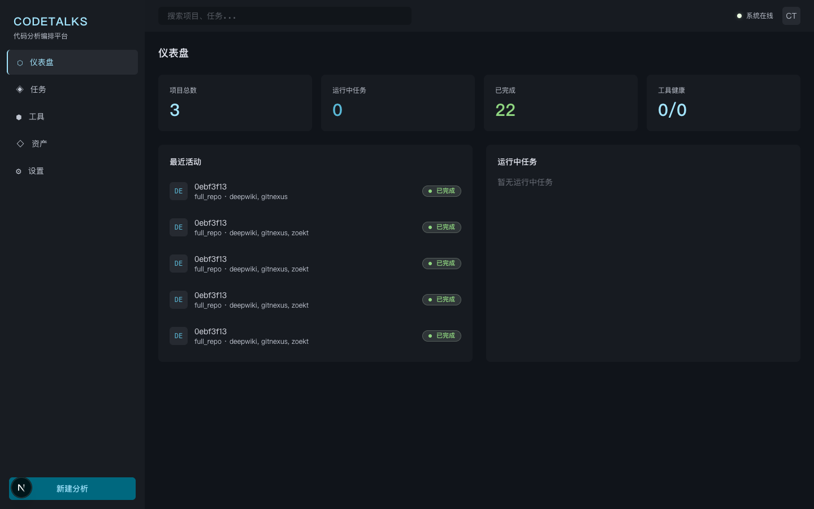

**能力说明**：
- 四维统计卡片：项目总数、运行中任务、已完成任务、工具健康状态（4/4 全在线）
- 最近活动流：实时展示最近 5 条分析任务及其状态
- 运行中任务面板：带进度条的实时任务监控，5 秒自动刷新
- 顶部全局搜索：跨项目、跨任务快速检索

**应用场景**：团队负责人每日登录后第一眼看到整体分析状况，快速判断是否有异常。

---

### 二、运行时风险概览 — 风险态势一目了然

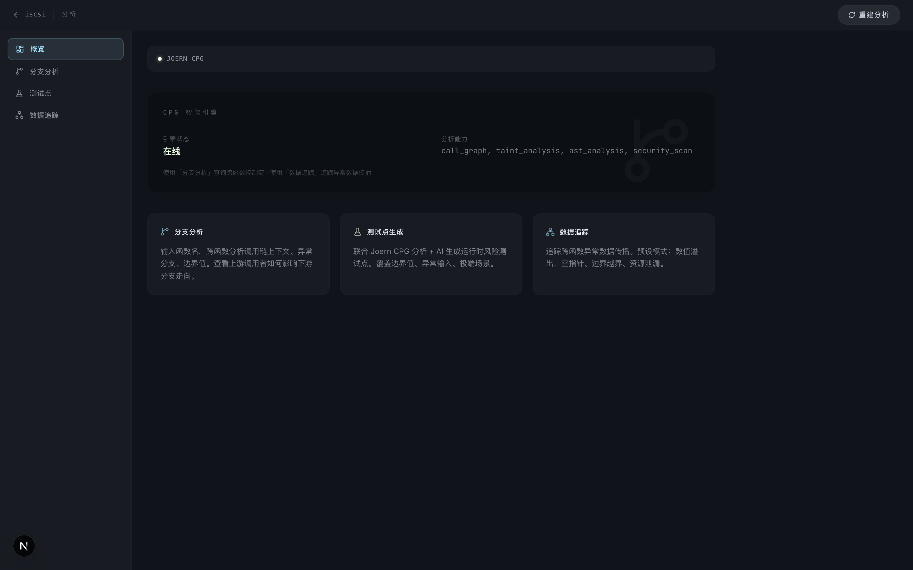

**能力说明**：
- **风险等级矩阵**：环形图直观展示 High Risk / Medium Risk / Low Risk 三级风险分布
- **Risk Categories**（风险类别）：柱状图统计 Top 5 运行时风险类别（溢出、空指针、边界越界等）
- **Joern CPG 引擎**：控制流/数据流/跨函数调用链深度分析
- **一键重建分析**：右上角按钮触发 CPG 重建，支持代码变更后刷新

**应用场景**：技术评审会议上，快速了解项目运行时风险面貌，包含异常分支、边界值和数值翻转等运行时隐患。

---

### 三、分支分析 — 精准定位运行时隐患

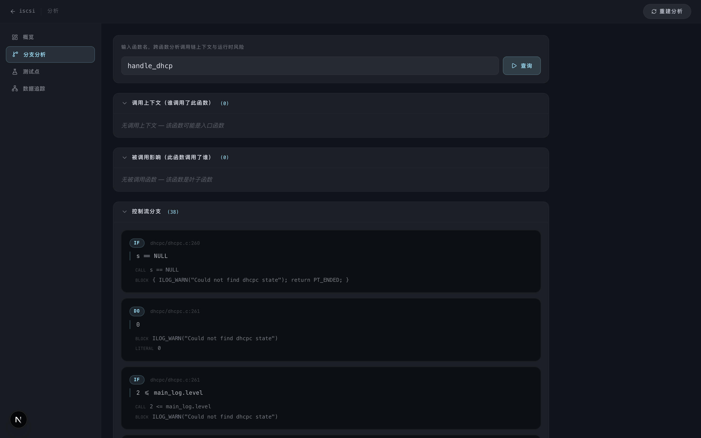

**能力说明**：
- 输入函数名，自动分析跨函数调用链上下文与运行时风险
- 控制流分支展示：IF / SWITCH / DO / BREAK 等结构，标注文件路径 + 行号
- 每个分支详情包含：条件表达式、代码块、调用和字面量
- 调用上下文：谁调用了此函数、从什么控制流进入
- 被调用影响：此函数调用了谁、对下游有什么影响

**应用场景**：开发人员分析关键函数的异常分支（如空指针检查、状态机跳转、边界条件），定位运行时风险路径。

---

### 四、数据传播追踪 — 追踪异常数据流向

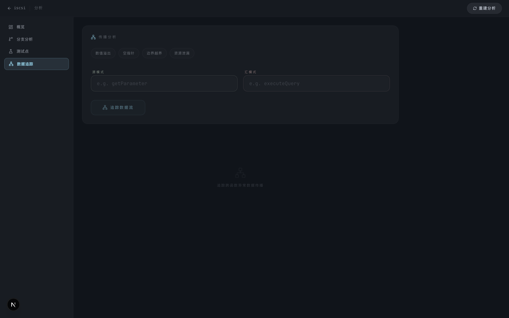

**能力说明**：
- **4 种预设检测模式**：数值溢出、空指针解引用、边界越界、资源泄漏
- 自定义 Source / Sink 模式：灵活定义数据来源和风险操作点
- 可视化传播链：Source（绿色）→ 中间节点 → Sink（红色），每个节点标注代码位置
- 基于 Joern CPG 引擎，进行跨函数的深度数据流分析

**应用场景**：开发团队定向追查某个外部输入在经过多层函数调用后，是否可能触发数值溢出、数组越界或空指针解引用等运行时异常。

---

### 五、知识图谱 — 代码结构可视化

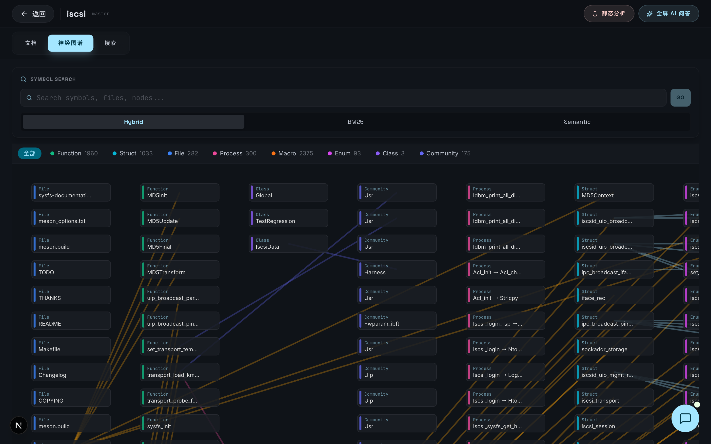

**能力说明**：
- **6221 个节点**的大规模代码知识图谱：
  - Function 1960 / Struct 1033 / File 282 / Process 300 / Macro 2375 / Enum 93 / Class 3 / Community 175
- 力导向图布局，节点按类型颜色区分
- 三种搜索模式：Hybrid / BM25 / Semantic
- 点击节点展开详情面板（函数签名、文件位置、调用关系）
- **「在 Chat 中追问」** 按钮：针对选中节点直接向 AI 提问

**应用场景**：新人 onboarding 理解项目架构，或跨团队 code review 时快速掌握模块关系。

---

### 六、AI 文档生成 — 自动化项目文档

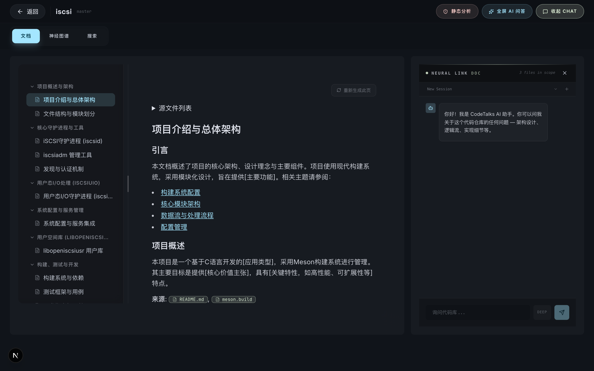

**能力说明**：
- DeepWiki 引擎基于 RAG 自动生成结构化项目文档
- 左侧可折叠目录树，按模块组织（项目概述、核心进程、配置管理等）
- 文档内含代码引用链接，点击直接跳转到源文件
- 侧边 AI 聊天面板：在阅读文档的同时向 AI 追问细节
- 支持一键刷新重新生成

**应用场景**：接手老项目时，不再需要花数天阅读代码，AI 直接生成文档结构；随时在侧边栏向 AI 提问。

---

## 次核心功能演示

### 七、测试点生成 — AI 辅助风险测试

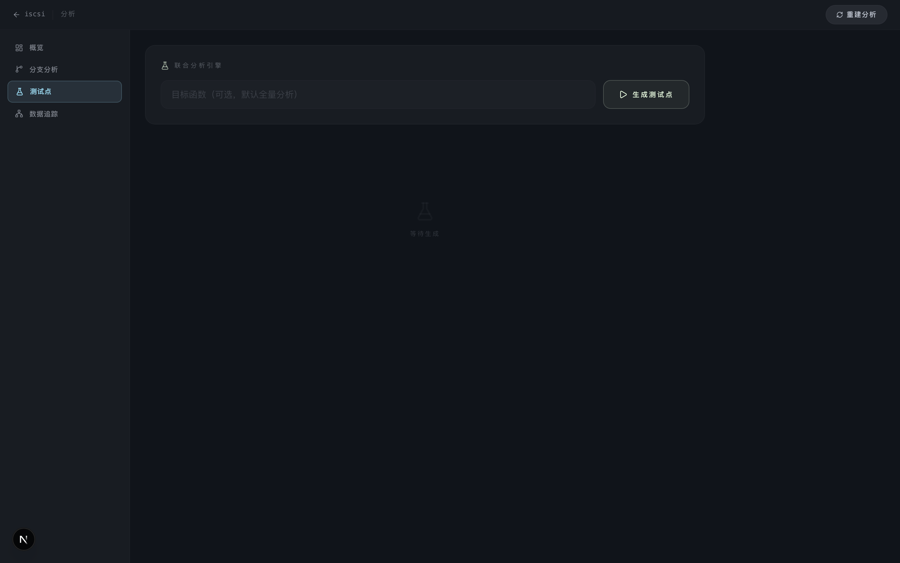

**能力说明**：
- **Joint Analysis Engine**：联合 Joern CPG 分析结果 + AI 生成
- 可指定目标函数，也可全量生成
- 每个测试点包含：风险等级、异常输入条件、期望行为、边界值、极端场景
- 支持导出为 Markdown / JSON 格式

**应用场景**：QA 团队根据生成的测试点编写边界条件和异常分支测试用例，覆盖数值翻转、空值传播、资源未释放等运行时风险场景。

---

### 八、资产管理 — 项目与仓库组织

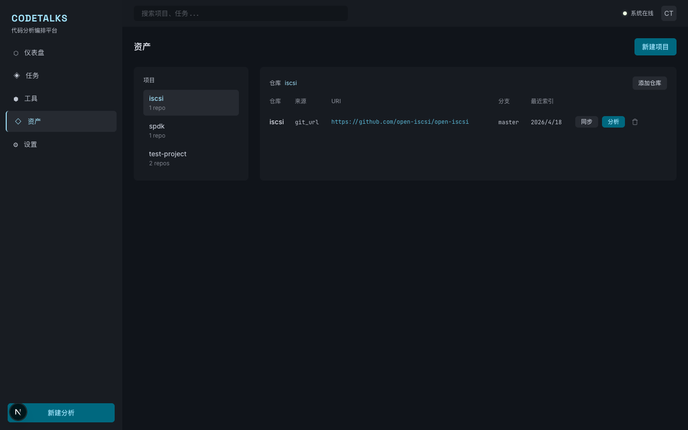

**能力说明**：
- 左右分栏：左侧项目树 → 右侧仓库列表
- 支持 Git URL 和本地路径两种代码导入方式
- 一键同步（git pull），一键分析
- 仓库表格展示：来源、URI、分支、最近索引时间
- 支持项目/仓库级别的删除（含确认弹窗）

**应用场景**：团队按项目组织多个代码仓库，统一管理分析任务。

---

### 九、工具监控 — 引擎健康可视化

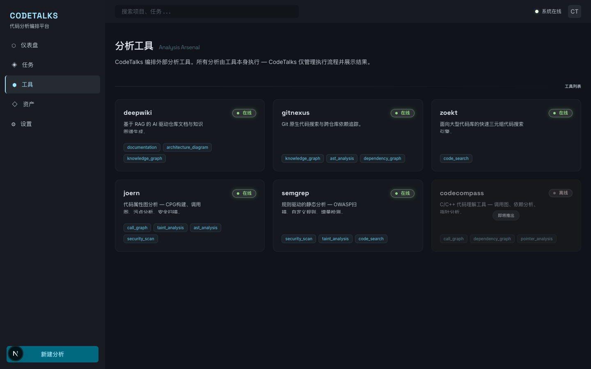

**能力说明**：
- 5 个分析工具卡片式展示，每个标注在线/离线/忙碌状态
- 每个工具列出具体能力标签（如 knowledge_graph、taint_analysis、risk_scan）
- 平台核心理念展示："所有分析由工具本身执行 — CodeTalks 仅管理执行流程并展示结果"
- 当前 4/4 核心工具在线，CodeCompass 即将推出

**应用场景**：运维人员实时监控工具健康，快速定位离线工具。

---

### 十、LLM 配置 — 灵活对接内网 AI

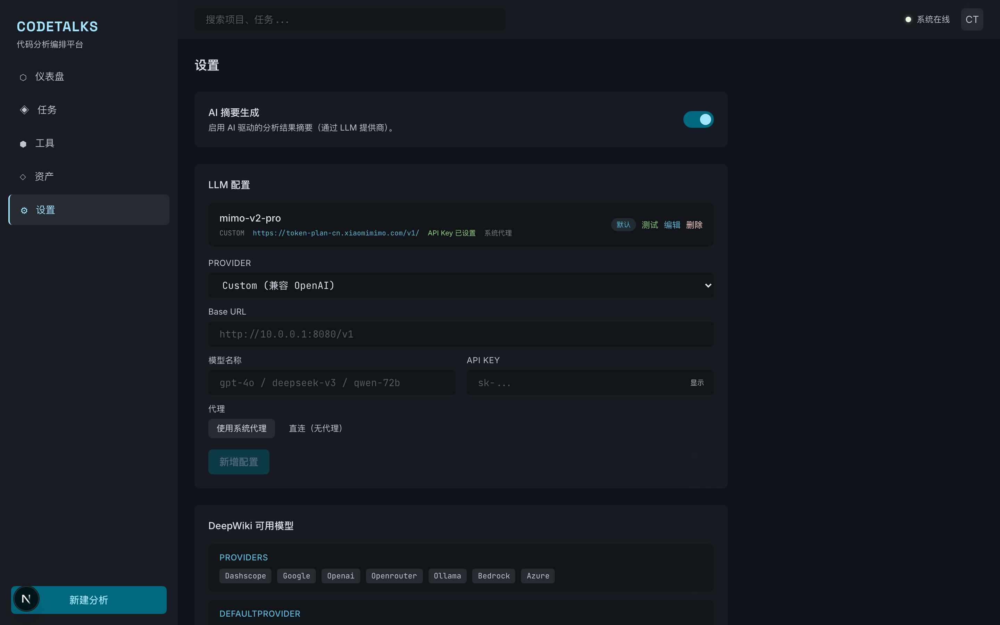

**能力说明**：
- AI 摘要功能开关（可按需启停）
- 多 LLM 配置管理：支持 OpenAI / Ollama / Google / OpenRouter / AWS Bedrock / 自定义
- 每个配置支持独立测试、设为默认、编辑、删除
- 代理模式切换：系统代理 / 直连（适配内网环境）
- API Key 加密存储（Fernet 加密）

**应用场景**：内网部署时对接本地 Ollama 或内网 LLM 代理，无需外网连接。

---

### 十一、任务管理 — 分析全生命周期

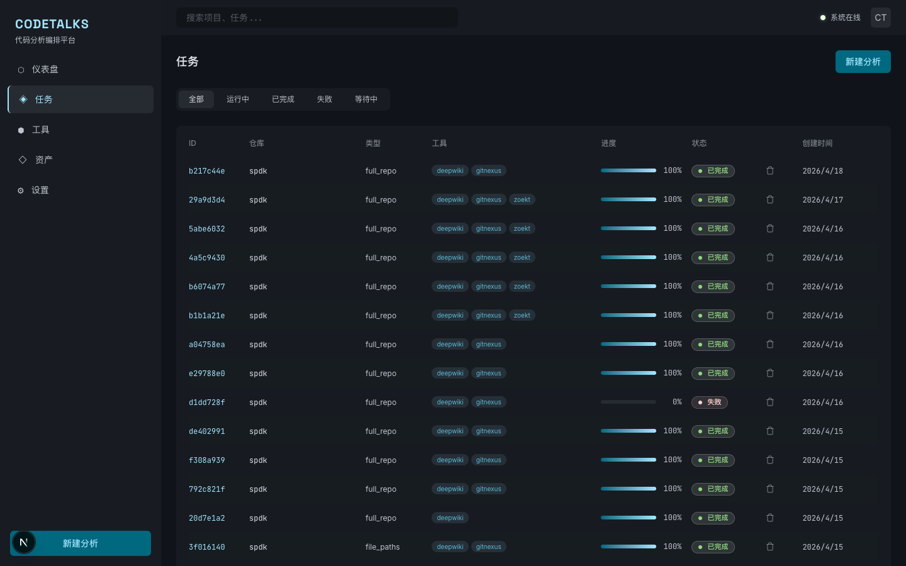

**能力说明**：
- 5 种状态过滤：全部 / 运行中 / 已完成 / 失败 / 等待中
- 任务表格：ID、仓库、类型、工具（彩色标签）、进度条、状态、操作
- 支持停止运行中任务、删除历史任务
- 全局「新建分析」快捷入口

**应用场景**：分析工程师管理批量扫描任务，追踪进度和状态。

---

## 技术亮点

| 维度 | 说明 |
|------|------|
| **纯编排架构** | CodeTalks 零分析逻辑，100% 依赖外部工具 — 移除任何工具容器后系统报连接错误而非静默降级 |
| **工具可插拔** | 每个分析引擎独立容器化，可按需启停，互不影响 |
| **容器故障自愈** | 验证 166/166 用例通过：工具容器 stop → 优雅降级 → restart → 数据完整恢复 |
| **零内存泄漏** | 压力测试（10 轮连续扫描 + 30 分钟 soak）堆内存零增长 |
| **内网可部署** | 完整 K8s 清单 + Air-gapped 部署手册，支持 Harbor 镜像导入 |
| **深色科技主题** | Kinetic Shadow 设计语言，毛玻璃效果面板，三色强调体系 |

---

## 部署方式

| 方式 | 说明 |
|------|------|
| **Docker Compose** | 本地开发/演示，一键 `docker compose up` |
| **K8s + Harbor** | 内网生产部署，完整清单 6 个 YAML，详细操作手册 |

---

## 后续规划

- CodeCompass 集成（C/C++ 调用图 + 指针分析）
- Zoekt 实时增量索引
- 多人协作与权限管理
- 分析报告导出（PDF/HTML）
- CI/CD Pipeline 集成（GitLab CI / Jenkins）

---

*CodeTalks — 让代码运行时风险分析从「工具散落」走向「编排一体」*
