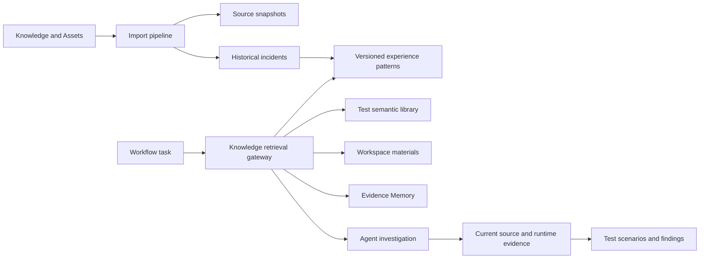

# Test Knowledge Center and Experience Retrieval

## Goal

Turn historical incidents into reusable test knowledge so CodeTalk can discover abnormal, boundary, recovery, concurrency, and state-transition scenarios that are often missed before release. Retrieval must improve investigation and test design without converting historical similarity into an unsupported current-code defect claim.

The first release prioritizes historical incidents. Existing test semantic cases and Evidence Memory remain separate, reusable sources. A broader test-asset catalog can follow only after incident retrieval proves useful.

## Product Position

`Knowledge and Assets` is a secondary management area with three initial views:

1. Historical Incidents: raw sources, CodeHub enrichment, and incident facts.
2. Experience Patterns: reusable patterns, versions, applicability, exclusions, and usage history.
3. Import Jobs: paste/file batches, progress, duplicates, failures, and retry actions.

Workflow design and the run cockpit remain the primary test-activity path. Users do not build RAG nodes or choose parsers. Workflows declare typed knowledge needs and retrieval happens automatically.

## Why This Is Not One Generic RAG

The content has different authority and lifecycle rules:

| Knowledge type | Source of truth | Retrieval role | May confirm a current defect alone? |
|----------------|-----------------|----------------|-------------------------------------|
| Historical incident | Source snapshot plus incident record | Recall symptoms, causes, and context | No |
| Experience pattern | Versioned structured pattern | Generate investigation hypotheses and tests | No |
| Test semantic case | Structured case record | Reuse terminology, steps, and assertions | No |
| Test asset | File plus metadata and parser output | Locate scripts, datasets, tools, and environment material | No |
| Workspace material | Original uploaded file | Supply requirement/design context | No |
| Evidence Memory | Validated source slices and accepted artifacts | Support or reject a current-task claim | Only when its current provenance is valid |

RAG is therefore a derived retrieval layer. It does not own truth, record lifecycle, or source files.

## Architecture



The retrieval gateway returns typed records. It never flattens all knowledge into interchangeable text chunks.

## Existing Foundation to Reuse

- `backend/app/services/material_rag.py`: workspace material chunking and embeddings.
- `backend/app/services/evidence_memory.py`: structured validated facts, FTS5, edges, and source slices.
- `backend/app/services/test_semantic_library.py`: structured semantic cases, bulk import, and FTS5 retrieval.
- `backend/app/services/workbench_task_run.py`: prepared task bundles that already retrieve Evidence Memory and semantic cases.
- Agent provider profiles and the run harness: Agent-owned MCP invocation, task artifacts, validation, retry, and degraded-mode reporting.

F011 should add an experience store and a federated gateway. It should not rewrite these stores or merge their tables in the MVP.

## Core Data Model

### Source Snapshot

A source snapshot preserves the minimum content needed for local retrieval and traceability:

```json
{
  "source_id": "src_...",
  "source_type": "docx|pdf|xlsx|paste|codehub_mr|codehub_issue",
  "source_uri": "...",
  "scope_type": "project|global",
  "scope_id": "...",
  "content_hash": "sha256:...",
  "revision": "...",
  "parent_source_id": "...",
  "locator_map_path": "...",
  "snapshot_path": "...",
  "fetched_at": "...",
  "ingest_status": "parsed|needs_ocr|unavailable|rejected"
}
```

CodeHub snapshots store necessary excerpts, critical diff hunks, identifiers, revisions, hashes, and the explicit reference path. They do not copy an entire project history by default.

### Historical Incident

An incident answers what happened in one historical case:

- title and summary;
- symptoms and observable impact;
- triggering conditions;
- state evolution and recovery behavior;
- root-cause conclusion and its source status;
- fix or existing fallback mechanism;
- affected version, module, protocol, and environment;
- source references and exact locators;
- project/global scope and lifecycle status.

An incident remains faithful to its source. Generalization belongs in patterns.

### Experience Pattern

A pattern answers what can be reused elsewhere:

- name and normalized terminology;
- triggering conditions;
- state transition or resource lifecycle;
- failure mechanism and blast-radius mechanism;
- observable symptoms;
- applicability conditions;
- exclusion conditions and known fallbacks;
- evidence required before raising a finding;
- investigation questions;
- suggested test dimensions and scenario seeds;
- supporting incident links.

Pattern identity and content versions are separate. Each edit creates a new version and moves the active pointer. Old, rejected, superseded, and restored versions remain traceable.

Use two independent states:

- `review_state`: `unreviewed`, `confirmed`, or `rejected`;
- `lifecycle_state`: `active`, `superseded`, or `deprecated`.

Unreviewed active patterns may participate in investigation retrieval. They cannot independently support an authoritative finding. Rejected patterns stay available for duplicate detection and regression tests but are excluded from normal retrieval.

### Relationships

- One incident may produce several patterns.
- One pattern may be supported by several incidents.
- Incident and pattern merging is reversible.
- Original sources are never rewritten by a merge.

## Knowledge Scope

The local store supports two scopes:

- Project: tied to an existing local workspace and a verified repository/project identity, ranked first for that project.
- Personal global: available across projects as a general investigation lead.

Scope assignment is automatic only from explicit evidence:

- an MR project key maps only when it exactly matches the canonical remote identity recorded for the selected workspace;
- a paste/file import maps to a project only when the user explicitly selected an existing workspace for that import;
- material without verified project identity enters personal-global scope;
- terminology alone cannot assign project ownership.

Canonical identity removes credentials, normalizes host casing and `.git`
suffixes, and compares the complete host/project path. Missing remotes,
ambiguous matches, unknown workspace ids, and non-matching MR project keys all
fall back to personal-global scope and record the reason.

Project patterns remain project-scoped by default. Promotion creates or links a personal-global pattern version rather than silently widening the original record.

## Ingestion Experience

### User Experience

The user either pastes a description or drops a batch of files, optionally supplies an MR link, and clicks `Agent extraction`. The user does not configure parsers, chunk sizes, MCP calls, or extraction stages.

### Technical Pipeline

```text
source registration and exact deduplication
-> deterministic DOCX/PDF/XLSX parsing and locator generation
-> optional explicit-MR CodeHub enrichment
-> Agent incident extraction
-> Agent pattern extraction
-> schema and source-reference validation
-> semantic duplicate proposals
-> searchable unreviewed records
```

Each stage records its own status and can be retried independently. A partial failure cannot cause the job to appear fully successful.

### Initial File Support

- DOCX: heading path, paragraph index, table and cell coordinates.
- Text PDF: page and ordered text-run coordinates. PDF table reconstruction is
  not promised in the MVP.
- XLSX: workbook, sheet, row, column, header, and cell range.
- Paste: immutable text snapshot with line locators.

Scanned PDFs fail with `needs_ocr` in the MVP. Legacy DOC/XLS and complex diagnostic binaries are outside the first ingestion contract.

### CodeHub Boundary

CodeHub is an explicit source enhancer, not an autonomous discovery engine:

1. No user-provided MR means no CodeHub search or exploration.
2. A supplied MR allows the Agent to read its description, comments, commits, diff, changed files, and test changes.
3. The Agent may read issues or MRs directly referenced by that MR.
4. Traversal stops after that one direct-reference hop.
5. The Agent does not perform keyword or similarity searches for additional records.
6. Every fetched, unavailable, forbidden, or broken source appears in `source_manifest.json`.

CodeTalk does not own CodeHub credentials. A configured Agent provider owns its MCP credentials and returns declared artifacts through the existing run harness.

## Deduplication and Curation

- Same CodeHub source identity: update or add a source revision to the same incident candidate.
- Same file hash: skip exact duplicate ingestion.
- Changed version of the same file: preserve a source-version relationship.
- Semantically similar incidents: propose a merge; never merge automatically.
- Similar pattern: propose linking the incident to the existing pattern or creating a new pattern.
- Different incidents may support one pattern after user confirmation.

New Agent-produced patterns become searchable as unreviewed investigation leads. The user does not review every import row. Review is requested when a pattern is used, rejected, edited, promoted, or otherwise demonstrates value.

## Retrieval Contract

Workflows declare knowledge needs:

```json
{
  "knowledge_policy": {
    "sources": ["experience_patterns", "semantic_cases"],
    "scopes": ["project", "personal_global"],
    "mode": "on_demand",
    "max_results": 12,
    "allow_followup": true
  }
}
```

Retrieval has two opportunities:

1. `preflight` retrieval uses the task target, module, requirements, and explicit inputs.
2. `on_demand` starts with zero injected records. When `allow_followup` is true,
   the Agent may write up to three queries to `knowledge_followup_requests.json`;
   CodeTalk injects `requested_knowledge` for one bounded second turn.

Candidate selection should use:

1. project/scope and structured metadata filters;
2. FTS5 for exact identifiers, function names, logs, protocol fields, and Chinese text;
3. embedding reranking for semantic similarity over a bounded candidate set;
4. applicability, exclusion, review state, and project affinity reranking;
5. source hydration only for the final bounded results.

Chinese prose and English identifiers must remain independently searchable. Alias terms may improve recall, but normalized aliases never replace the original source wording.

At the expected 1,000 to 10,000 incident scale, use local SQLite and FTS5. Do not add Qdrant, Elasticsearch, or another service. Avoid the current material-RAG pattern of loading every vector for every query; use filtered candidates and embedding reranking first. Adopt an embedded vector index later only if measured latency or recall requires it.

## Evidence and Output Policy

Retrieval results use explicit stages:

- `investigation_lead`: historical similarity or unreviewed pattern;
- `candidate_finding`: current evidence supports the mechanism but disconfirming checks remain;
- `confirmed_finding`: current evidence chain is complete;
- `ruled_out`: current implementation or fallback disproves the pattern.

For example, seeing a lock acquisition without an unlock in the same function remains an investigation lead until ownership, callers, wrappers, callbacks, error paths, and cross-file release behavior are checked.

Workflow artifacts include:

- `knowledge_retrieval.json`: query, providers, candidates, filters, ranks, degraded paths, and hydrated sources;
- `knowledge_usage.json`: patterns actually used, rejected, or ruled out and why;
- existing evidence artifacts: current code slices, hashes, and validation state.

Normal test deliverables stay concise. Each generated case carries `knowledge_refs`; detailed provenance appears in an expandable panel or appendix. High-risk unresolved claims are visible in the main body rather than hidden in the appendix.

## Local Storage and Runtime

Suggested layout:

```text
data/
  knowledge/
    knowledge.db
    sources/
    parsed/
    imports/
    indexes/
```

- SQLite records are authoritative for incidents, patterns, versions, links, and import jobs.
- Original/minimal source snapshots and parsed locator documents live in content-addressed files.
- FTS and embedding indexes are derived and rebuildable.
- User data stays outside the versioned desktop application directory so app replacement and rollback do not overwrite it.
- Schema changes require forward migration and a pre-migration backup; application rollback must detect incompatible data versions instead of opening them unsafely.

The deployment environment is responsible for keeping model and Agent endpoints on localhost or inside the intranet. F011 records the provider used for extraction and embeddings but does not add a DLP, permission, or approval subsystem.

## Evaluation

### Historical Replay Gate

Build a corpus from known incidents. For each replay, expose only the material, code, or MR information that would have been available before the fix. Evaluate:

- whether the relevant experience appears in the bounded retrieval set;
- whether unrelated patterns are rejected;
- whether generated tests exercise the historical failure mechanism;
- whether missing evidence remains explicit;
- whether the system avoids claiming that the current implementation is defective without proof.

Include standard success, misleading similarity, existing-fallback, incomplete-source, and no-embedding degraded cases.

### Real-Use Feedback

Record `used`, `rejected`, and `irrelevant` feedback for retrieved patterns. Use it to improve curation and evaluation selection, not as an automatic truth or authority score.

Report at least two separate quality dimensions:

- retrieval usefulness: relevant knowledge is available when needed;
- conclusion precision: formal findings do not contain unsupported historical analogies.

Do not collapse these into one "90% accurate" claim.

## MVP Boundary

The first release includes:

1. local incident/pattern/version/source contracts;
2. paste, DOCX, text PDF, and XLSX import;
3. one-click Agent extraction with deterministic parsing underneath;
4. explicit MR enrichment and one-hop direct references;
5. exact deduplication and semantic merge proposals;
6. project/global federated retrieval with existing semantic cases and Evidence Memory;
7. workflow-declared knowledge policies and audit artifacts;
8. Historical Incidents, Experience Patterns, and Import Jobs UI;
9. historical replay and real-use feedback.

Not in the MVP:

- autonomous CodeHub exploration;
- multi-user sharing, roles, or approval flows;
- external vector database services;
- OCR for scanned PDFs;
- packet capture, core, dump, or binary diagnostic parsing;
- a generic catalog for every test asset type;
- automatic semantic merging;
- treating experience retrieval as current-code evidence.

## Implementation Open Questions

1. Select additional historical replay cases beyond the two iSCSI cases and the
   cross-function lock-release false-positive fixture.
2. Decide whether the experience store lives in one new `knowledge.db` or shares a migration framework with existing Workbench stores; the public contracts must not depend on that physical choice.

## Rejected Directions

- One generic vector store for incidents, test cases, assets, materials, and evidence: rejected because it erases authority and lifecycle differences.
- External vector infrastructure in the first release: rejected because the expected scale does not justify another Windows runtime service.
- Raw binary documents handed directly to an unconstrained Agent: rejected because completeness, retries, and source locators would be nondeterministic.
- Agent search of CodeHub without an explicit MR: rejected because it expands scope and creates unreliable associations.
- Mandatory review of every extracted record: rejected because it front-loads expert effort before an experience demonstrates value.
