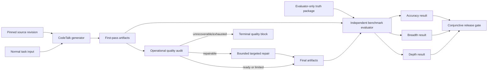
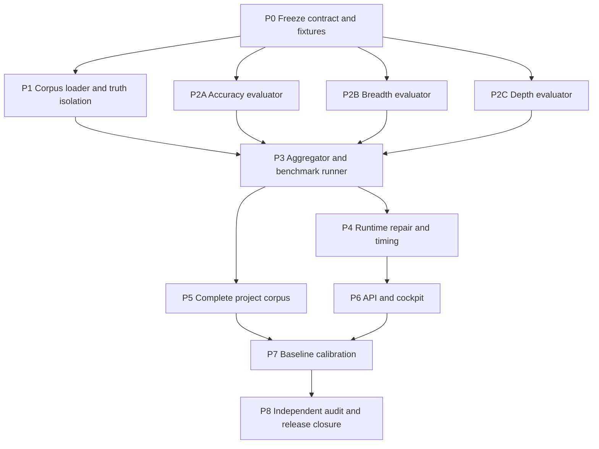

# F012 Independent Quality Evaluation Baseline Implementation Plan

> **Feature**: [F012](../features/F012-quality-evaluation-baseline.md)
> **Decision**: [ADR-025](../decisions/adr-025-independent-three-axis-quality-evaluation.md)
> **Goal**: independently validate CodeTalk outputs on Accuracy, Breadth, and Depth, then make bounded automatic repair the normal path and terminal blocking the fallback
> **Acceptance criteria**: F012 AC1-AC10
> **Architecture**: evaluator-only truth package + three independent evaluators + benchmark runner + existing runtime/cockpit integration
> **Tech stack**: Python 3, Pydantic 2, FastAPI, pytest, Next.js 16, React 19, TypeScript, Playwright
> **Frontend validation**: existing run cockpit only; screenshots at 1440x900, 1280x800, and 390x844

> **Repository note**: this repository intentionally ignores new files under `docs/features/` and `docs/decisions/`. When F012 documentation is committed, stage only the two exact F012/ADR-025 paths explicitly; do not broaden or remove the existing ignore rules.

## 1. Goal-Mode Root Contract

Use this section as the root goal when starting Goal mode.

### Root objective

Deliver F012 end to end: a reproducible independent benchmark system and production quality workflow that evaluate Accuracy, Breadth, and Depth separately; exercise every requested storage-related domain; automatically repair repairable gaps within time budgets; and retain independent development, testing, and audit evidence.

### Terminal condition

The goal is complete only when all of the following are true:

1. F012 AC1-AC10 are checked with linked evidence.
2. The complete initial corpus registry includes all named projects at immutable commits.
3. At least one critical Tier S case per requested domain executes successfully.
4. Available Tier E cases execute in isolation; unavailable Tier E/H cases report explicit limitations.
5. Accuracy, Breadth, and Depth reports use independent denominators and have no aggregate score.
6. A rapid run respects 15 minutes and a deep run respects 90 minutes.
7. An under-5-minute run is diagnosed through work sufficiency, not rejected by duration.
8. Repairable fixtures recover automatically; unrecoverable fixtures block only after bounded repair or immediately documented hard failure.
9. Backend, frontend, integration, leakage, corpus, and benchmark tests pass.
10. Desktop/mobile screenshot evidence passes the product UI rules.
11. Independent reviewers approve each evaluator and a separate Vision Guardian approves the final product behavior.
12. The quality-gate -> request-review -> receive-review -> merge-gate sequence is complete.

Do not mark the goal complete because code exists, a subset of projects passes, or the token/time budget is nearly exhausted.

### Root non-goals

- Do not build a separate dashboard, corpus-management UI, or quality database.
- Do not use model consensus, runtime, output length, citation count, or current self-reported candidates as ground truth.
- Do not execute arbitrary third-party scripts or access production Redis 6399.
- Do not claim Tier H validation from Tier S/E evidence.
- Do not freeze numeric release thresholds before baseline calibration.
- Do not refactor unrelated workbench runtime or cockpit code.

### Hard invariants

1. Hidden truth never enters generator input, prompts, retrieval, task bundles, or normal run artifacts.
2. No axis uses another axis as a substitute or compensation.
3. No combined weighted score is emitted.
4. Critical misses remain visible even when percentage scores are high.
5. Ordinary runs say `operational`; only registered hidden-truth runs say `independent_benchmark`.
6. Accepted artifacts survive failed repair attempts.
7. Repair is bounded by attempts, wall clock, repeated defect signature, and no progress.
8. Redis dev/test, if needed, uses 6398 only.
9. An author may test their own code but may not approve it.

## 2. Current-State Evidence

The implementation must extend current behavior rather than recreate it:

- `backend/app/services/source_driven_test_design.py` builds the current judge report. Its `facts` result primarily measures verified emitted claims, and its coverage result primarily consumes generated candidates/dispositions.
- `backend/app/services/artifact_contract_v3.py` owns the claim ledger and artifact contract.
- `backend/app/services/test_activity_contract.py` contains exact-evidence and behavior-support validation that can be reused at L1/L2.
- `backend/app/services/workbench_workflow_runner.py` already contains deterministic repair, external repair, rollback, regression, no-progress, timeout, and repair-history logic. F012 must audit and consolidate that path, not add a parallel retry subsystem.
- `frontend/src/features/runs/run-cockpit-page.tsx` already renders operational quality axes and terminal `quality_blocked` behavior.
- `frontend/src/lib/types.ts` currently types `structure`, `facts`, `executability`, `coverage_breadth`, and `coverage_judge` axes.

The principal measurement gap is independent truth and independent denominators, not absence of all quality or repair machinery.

## 3. Target Architecture



### Component ownership

| Component | New primary path | Responsibility |
|---|---|---|
| Strict contract | `backend/app/services/quality_evaluation_contract.py` | Versioned schemas, enums, validators, report serialization |
| Corpus loader | `backend/app/services/quality_benchmark_corpus.py` | Registry, immutable revisions, truth isolation, integrity checks |
| Accuracy | `backend/app/services/quality_accuracy_evaluator.py` | Emitted-claim precision, gold recall, contradiction, L0-L3 |
| Breadth | `backend/app/services/quality_breadth_evaluator.py` | Independent universe matching and critical coverage |
| Depth | `backend/app/services/quality_depth_evaluator.py` | Critical-chain closure, state/resource/error/oracle depth |
| Aggregator | `backend/app/services/quality_evaluator.py` | Calls three evaluators; conjunctive status; no scoring logic duplication |
| Benchmark runner | `backend/app/services/quality_benchmark_runner.py` | Post-run evaluation, first/final snapshots, immutable reports |
| CLI | `scripts/run_quality_benchmark.py` | Run one case/domain/corpus and write summary |
| API projection | `backend/app/api/quality_evaluations.py` | Read-only run evaluation endpoint; no truth-package response |
| Runtime integration | existing `workbench_workflow_runner.py` and `workbench_task_run.py` | Operational scope, work sufficiency, bounded repair state |
| Cockpit | existing run feature plus `quality-evaluation-panel.tsx` | Scope, axes, repair progress, limitations, progressive details |

### Storage contract

- Commit registry metadata and truth packages under `benchmarks/quality/`.
- Do not commit cloned repositories, build trees, model output, or benchmark reports.
- Resolve sources from `CODETALK_QUALITY_CORPUS_ROOT`.
- Store per-run evaluation reports with existing run artifacts as `quality_evaluation_report.json`.
- Store complete-corpus output outside Git under a caller-selected `--output` directory.
- Do not add a database table unless implementation evidence proves immutable artifacts cannot satisfy retrieval needs; that change requires a new decision review.

### Report shape

The canonical JSON must contain this information, with strict field names finalized by the contract Agent:

```json
{
  "schema_version": "quality-evaluation-v1",
  "scope": "independent_benchmark",
  "case_id": "rdma-core-cq-error-recovery-001",
  "source_revision": "<40-char commit>",
  "truth_package_version": "1",
  "run_ref": "<run id>",
  "first_pass": {
    "accuracy": {"status": "fail", "numerator": 7, "denominator": 10},
    "breadth": {"status": "fail", "numerator": 8, "denominator": 12},
    "depth": {"status": "fail", "numerator": 14, "denominator": 20}
  },
  "final_after_auto_repair": {
    "accuracy": {"status": "pass", "numerator": 10, "denominator": 10},
    "breadth": {"status": "pass", "numerator": 12, "denominator": 12},
    "depth": {"status": "limited", "numerator": 19, "denominator": 20}
  },
  "repair_summary": {"attempt_count": 2, "elapsed_seconds": 83},
  "hard_failures": [],
  "limitations": ["L3_NOT_RUN"]
}
```

There is deliberately no `overall_score`.

## 4. Evaluation Semantics

### Accuracy denominator

- **Claim precision**: independently supported factual claims / all factual claims in the submitted result.
- **Gold recall**: matched applicable gold claims / all applicable gold claims.
- Record unsupported, contradicted, insufficient, and omitted claims separately.
- A critical contradiction or unsupported critical claim is a hard failure.
- L0 is schema validity; L1 is exact source/provenance; L2 is semantic entailment; L3 is execution-oracle confirmation.
- L2 may use a model-assisted matcher only behind deterministic candidate extraction, exact evidence bounds, stable fixtures, and reviewer-approved failure tests.

### Breadth denominator

The truth package defines independently reviewable items in these dimensions:

- entry points;
- end-to-end flows;
- branches and alternatives;
- state transitions;
- resource acquisition, ownership, release, and leak paths;
- component/system boundaries;
- concurrency, ordering, and race obligations;
- errors, propagation, cleanup, and recovery;
- protocol, historical, and mutation obligations when applicable.

Report discovery recall, critical coverage, scenario realization, disposition completeness, per-dimension misses, and critical misses. Generated candidates may provide evidence but may not define the only denominator.

### Depth denominator

Each critical chain is an ordered graph of required nodes/edges:

`external trigger -> precondition/input -> entry -> call chain -> state/resource mutation -> downstream effect -> error propagation -> cleanup/recovery -> external observation -> executable oracle`

Report minimum critical-chain closure, average chain closure, state closure, resource-lifecycle closure, error/recovery closure, disconfirming checks, and L3 execution. Gate on the weakest critical chain so one deep flow cannot mask another shallow flow.

### Delivery status

- `ready`: every required axis passes and no hard failure exists.
- `limited`: no critical falsity exists, but an explicitly allowed environment limitation such as `L3_NOT_RUN` prevents full validation.
- `not_ready`: at least one axis fails or a hard failure exists.
- `quality_blocked`: runtime terminal state only after repair exhaustion or unrecoverable failure; it is not an evaluation score.

## 5. Corpus Plan

### Registry layout

```text
benchmarks/quality/
  registry.json
  schemas/
    registry.schema.json
    case.schema.json
  projects/<project-id>/
    project.json
    cases/<case-id>/
      case.json
      gold_claims.json
      coverage_universe.json
      critical_chains.json
      execution_oracles.json
```

JSON is used to avoid adding a YAML runtime dependency. Pydantic remains the runtime authority; JSON Schema supports authoring and CI diagnostics.

### Required project matrix

| Wave | Domain | Project | Minimum initial case | Tier |
|---|---|---|---|---|
| 1 | anchor storage stack | SPDK | request path + error/cleanup | S/E |
| 1 | controller/card emulation | FEMU | NVMe command path + timing/error | S/E |
| 1 | BMC storage management | phosphor-nvme | inventory/event/state path | S |
| 1 | BMC state | phosphor-state-manager | transition + failure recovery | S/E |
| 1 | BMC API | bmcweb | Redfish request/auth/error path | S/E |
| 1 | KV Cache | LMCache | put/get/evict + failure path | S/E |
| 1 | RDMA | rdma-core | verbs resource lifecycle + completion/error | S/E/H |
| 1 | RDMA/RoCE | UCX | transport selection + endpoint/error | S/E/H |
| 2 | computational storage | nvme_csd | command/offload path + error | S/E |
| 2 | host cache | Open-CAS | cache I/O path + recovery | S/E |
| 2 | KV Cache/RDMA | Mooncake | transfer/store path + failure | S/E/H |
| 2 | RDMA/RoCE tools | perftest | RoCE configuration + test/oracle failure | S/E/H |

All rows are required for AC7. Waves control implementation order, not final scope.

### Corpus onboarding gate

For each project, the Corpus Agent must:

1. Verify the canonical GitHub origin from project-maintainer documentation.
2. Record license and whether test execution is permitted.
3. Resolve and pin a 40-character commit.
4. Record clone strategy and expected source hash.
5. Select a bounded critical behavior, not a broad “understand the project” prompt.
6. Author source-backed gold claims, universe items, chains, and oracles.
7. Obtain a second independent domain review.
8. Prove the truth package is absent from generator-visible paths.

The corpus must contain holdout cases whose truth is not used to tune evaluator heuristics.

## 6. Goal-Mode Execution Protocol

### State machine

Every subgoal moves through:

`pending -> red_test -> implementation -> local_green -> handed_off -> independent_review -> accepted`

Allowed exceptional states are `needs_evidence`, `changes_requested`, and `blocked`. A subgoal is never `accepted` solely because its author reports green tests.

### Subgoal envelope

Every Agent receives this exact envelope:

```text
Objective:
Acceptance criteria:
Allowed write paths:
Forbidden write paths:
Required inputs:
Required tests and commands:
Required output artifacts:
Handoff recipient:
Stop conditions:
```

### Required handoff

Each implementation and review handoff uses:

```text
What: files, behavior, and tests changed or reviewed
Why: requirement and evidence addressed
Tradeoff: chosen constraint and rejected alternative
Open Questions: unresolved facts only; use "none" when closed
Next Action: one concrete owner and action
```

### Parallelism and ownership

- Contract and Corpus work start first.
- Accuracy, Breadth, and Depth may run in parallel only after contract fixtures are accepted.
- Each axis Agent writes only its evaluator and dedicated tests.
- Runtime Repair Agent is the sole owner of existing workflow-runner edits during its phase.
- Integration Agent is the sole owner of aggregator, runner, API registration, and cross-axis integration tests.
- UI Agent starts from an accepted API fixture and does not edit backend files.
- Audit Agents are read-only except for their assigned review note.
- Any needed cross-owner edit is requested through a handoff; do not silently edit another Agent's path.

### Stop conditions for all Agents

Stop and escalate when:

- a change would expose hidden truth to generation;
- a new persistent subsystem or database appears necessary;
- an evaluator needs a shared-contract change after contract freeze;
- a test would require Redis 6399, raw block devices, unrestricted network, or unallowlisted external execution;
- an axis can pass despite a critical miss;
- a proposed threshold is unsupported by baseline data;
- unrelated user changes overlap the owned files and cannot be preserved.

## 7. Roles And Review Separation

| Role | Owns | Must not approve |
|---|---|---|
| Goal Controller / Integration Lead | phase state, dependency release, P3/P7 integration | final product or own integration |
| Contract Agent | schema, validators, canonical fixtures | own contract |
| Corpus Infrastructure Agent | registry loader, manifests, integrity and leakage tests | own loader or corpus truth correctness |
| Domain Corpus Author | project-specific truth packages and mutation fixtures | own cases |
| Accuracy Agent | accuracy evaluator and tests | Accuracy evaluator |
| Breadth Agent | breadth evaluator and tests | Breadth evaluator |
| Depth Agent | depth evaluator and tests | Depth evaluator |
| Runtime Repair Agent | operational audit/repair integration and tests | repair behavior |
| Integration Agent | aggregator, runner, API, main registration, integration tests | final system |
| UI Agent | cockpit panel, types/client, Playwright UI test | UI acceptance |
| Contract Auditor | contract invariants and scope separation | authored contract |
| Accuracy Auditor | adversarial Accuracy review note | authored Accuracy code |
| Breadth Auditor | adversarial Breadth review note | authored Breadth code or truth cases under review |
| Depth Auditor | adversarial Depth review note | authored Depth code or truth cases under review |
| Runtime/Security Auditor | repair-before-block, truth isolation, API exposure | authored runtime, loader, or API code |
| UI Auditor | cockpit states, progressive disclosure, screenshots | authored UI code |
| Vision Guardian | F012/ADR compliance and final gaps | any implementation approval they authored |

Cross-family review is preferred. If the available pool cannot preserve identity and no-self-review constraints, stop at `handed_off` and request an eligible reviewer.

### Agent selection assessment

The available host currently supports `gpt-5.6-sol`, `gpt-5.6-terra`, `gpt-5.6-luna`, `gpt-5.5`, and `gpt-5.4`. F012 is dominated by semantic-oracle design, causal reasoning, a large runtime state machine, and adversarial audit. The staffing policy is therefore:

- use `gpt-5.6-sol` for quality-bearing architecture, evaluators, runtime, integration, and domain truth;
- use `gpt-5.6-terra` where balanced implementation/review capability is enough, especially UI and an independent semantic review;
- use `gpt-5.5` for selected fresh-context adversarial audits to reduce same-model correlated judgment;
- reserve `gpt-5.6-luna` or smaller/faster models for mechanical reruns, log collation, or schema formatting that makes no quality decision;
- never assign a fast model to author or approve gold claims, coverage denominators, critical chains, release thresholds, or terminal-block semantics.

`reasoning_effort` below is the actual Codex reasoning setting. Workload is relative delivery size, not a quality rating or wall-clock promise:

- **M**: bounded component or UI change with established contract;
- **L**: one evaluator/contract and its adversarial tests;
- **XL**: cross-cutting runtime/integration or multi-project domain corpus.

### Recommended Agent identities

These are 16 lifecycle identities, not simultaneous processes: 11 development/domain identities and 5 non-author audit identities. Preserve each identity across its implementation and handoff so authorship remains auditable.

| ID | Selection | Model | `reasoning_effort` | Workload | Rationale |
|---|---|---|---|---|---|
| A0 | Goal Controller + P3/P7 Integration Lead | `gpt-5.6-sol` | `max` | XL | Owns the dependency graph and cross-axis integration; does not approve final delivery |
| A1 | Contract + Corpus Infrastructure Agent | `gpt-5.6-sol` | `xhigh` | L | Contract and loader share schema/integrity concerns, but A1 authors no domain truth |
| A2 | Accuracy Agent | `gpt-5.6-sol` | `xhigh` | L | Omission recall, entailment, contradiction, and L0-L3 require careful semantic separation |
| A3 | Breadth Agent | `gpt-5.6-sol` | `xhigh` | L | Independent denominators and critical per-dimension gates are high-reasoning work |
| A4 | Depth Agent | `gpt-5.6-sol` | `max` | XL | Critical-chain graphs and weakest-chain gating are the hardest evaluator semantics |
| A5 | Runtime Repair Agent | `gpt-5.6-sol` | `max` | XL | Existing runner is large and already has repair/rollback/deadline paths; regression risk is high |
| A6 | UI Agent | `gpt-5.6-terra` | `high` | M | Contract is fixed; work is bounded to the existing cockpit and responsive states |
| D1 | Storage Controller/Host Corpus Author | `gpt-5.6-sol` | `xhigh` | XL | SPDK, FEMU, nvme_csd, and Open-CAS require storage-path and lifecycle reasoning |
| D2 | BMC Corpus Author | `gpt-5.6-sol` | `xhigh` | L | phosphor-nvme, phosphor-state-manager, and bmcweb share inventory/state/API behavior |
| D3 | KV Cache Corpus Author | `gpt-5.6-sol` | `xhigh` | L | LMCache and Mooncake require cache lifecycle, eviction, transfer, and failure truth |
| D4 | RDMA/RoCE Corpus Author | `gpt-5.6-sol` | `max` | XL | rdma-core, UCX, perftest, and explicit RoCE semantics have the highest domain depth and Tier E/H risk |
| R1 | Contract + Accuracy Auditor | `gpt-5.6-terra` | `xhigh` | L | Reviews scope/schema and omission/contradiction behavior without sharing the Accuracy author's context |
| R2 | Breadth Auditor | `gpt-5.5` | `xhigh` | L | A different model generation independently challenges universe completeness and critical coverage |
| R3 | Depth Auditor | `gpt-5.6-sol` | `ultra` | L | Highest audit effort is reserved for causal-chain closure, weakest-chain gating, and L3 limitations |
| R4 | Runtime/Security Auditor | `gpt-5.5` | `xhigh` | L | Model diversity helps challenge leakage, repair-state, rollback, API, and deadline assumptions |
| R5 | UI Auditor + Vision Guardian | `gpt-5.6-sol` | `ultra` | L | Runs only after other audits; checks cockpit truthfulness and final F012/ADR compliance |

Do not collapse A0 and R5, A1 and R4, any axis author and its corresponding R1/R2/R3 auditor, or R5 into an implementation role. Those separations protect the most consequential approval boundaries.

Effort allocation is intentionally asymmetric: `high` x1, `xhigh` x9, `max` x4, and `ultra` x2. `ultra` is used only for the Depth adversarial audit and final Vision gate; using it for routine implementation would add cost without improving the ownership model. No quality-bearing identity is assigned `low` or `medium`.

### Model/effort fallback policy

- Do not silently downgrade an assigned model or `reasoning_effort`.
- If `gpt-5.6-sol max` is unavailable, use `gpt-5.6-sol xhigh` and require the corresponding auditor to add a second adversarial pass.
- If an `ultra` audit is unavailable, use two independent `max` audit identities; neither may be the implementation author.
- If `gpt-5.5 xhigh` is unavailable, use `gpt-5.6-terra xhigh` but record loss of cross-generation diversity as a limitation.
- Mechanical benchmark operators may use `gpt-5.6-luna medium`, but their output is logs and manifests only; A0 and the assigned auditor own every interpretation or disposition.
- Any fallback is written into the retained environment manifest and review note before acceptance.

### Domain truth review pairing

- D1 and D2 cross-review storage-management boundary cases, then R1/R2/R3 independently check Accuracy, Breadth, and Depth truth methodology.
- D3 and D4 cross-review KV-over-RDMA and transfer/error cases, then R1/R2/R3 independently check Accuracy, Breadth, and Depth truth methodology.
- A domain cross-review is necessary but not sufficient: the three axis auditors must also run corpus mutation tests and challenge criticality/applicability decisions in their own dimensions.
- If a project-specific fact remains disputed, add an external maintainer source or execution oracle; Agent agreement does not resolve it.

### Concurrency schedule

Never launch all identities together. The repository's deep execution profile is designed around at most four auxiliary Agents, and file ownership is easier to preserve at that limit.

| Wave | Concurrent work | Gate before next wave |
|---|---|---|
| W0 | A0 maps current ownership; A1 implements P0 | P0 contract accepted by R1 |
| W1 | A1/P1, A2/P2A, A3/P2B, A4/P2C | all four local-green; R1/R2/R3 accept their assigned contracts/evaluators |
| W2 | A0/P3 plus D1, D2, D3 draft disjoint corpus cases | synthetic conjunctive gate passes; draft truth never reached generator |
| W3 | A5/P4, A6/P6 fixture work, D4 corpus, A0 integration support | runtime tests pass; API fixture frozen; all corpus rows authored |
| W4 | A6 finishes P6; D1-D4 cross-review; A0 completes P5 integration | UI checkpoint and corpus integrity/mutation gates pass |
| W5 | A0/P7 baseline; R1-R4 may inspect retained outputs without approving early | frozen rerun is reproducible and threshold candidate is explicit |
| W6A | R1 Accuracy, R2 Breadth, R3 Depth, and R4 Runtime/Security audits | confirmed findings resolved and affected gates rerun |
| W6B | R5 UI audit and final Vision gate | prior audit dispositions are closed and F012/ADR remains satisfied end to end |

The immediate critical path stays local to A0/A1 at contract and integration gates. Sidecar Agents work only on disjoint files or read-only review, so parallelism does not become merge churn.

### Dispatch matrix

The Goal-mode controller uses this table to instantiate the subgoal envelope. P2A/P2B/P2C are three parallel work packages inside phase P2; therefore P0-P8 contains nine phases and eleven independently handable work packages.

| Work package | Required inputs | Required output | Handoff recipient |
|---|---|---|---|
| P0 Contract | F012, ADR-025, current claim/quality fixtures | accepted strict schema and canonical fixtures | R1 Contract Auditor, then Corpus/Axis/Integration Agents |
| P1 Corpus loader | accepted P0 schema, current task bundle/prompt/retrieval paths | pinned registry loader and truth-isolation evidence | R4 Runtime/Security Auditor, then Integration and Domain Corpus Agents |
| P2A Accuracy | accepted P0 fixtures, claim ledger, exact-evidence contract | Accuracy module, adversarial tests, audit-ready handoff | R1 Accuracy Auditor, then Integration Agent |
| P2B Breadth | accepted P0 fixtures, current candidate/disposition artifacts | Breadth module, adversarial tests, audit-ready handoff | R2 Breadth Auditor, then Integration Agent |
| P2C Depth | accepted P0 fixtures, source behavior and test-activity artifacts | Depth module, adversarial tests, audit-ready handoff | R3 Depth Auditor, then Integration Agent |
| P3 Integration | accepted P1/P2 outputs | aggregator, runner, CLI, API, synthetic checkpoint | Runtime Repair and UI Agents |
| P4 Runtime | accepted operational report fixture, current repair call-chain map | bounded repair/timing behavior and regression evidence | R4 Runtime/Security Auditor, then Integration Agent |
| P5 Corpus cases | accepted P1 loader and P2 evaluators | all required pinned projects/cases and domain reviews | Integration Agent for registry merge |
| P6 Cockpit | accepted API fixtures for every required UI state | existing-cockpit integration, E2E, three viewport screenshots | R5 UI Auditor, then R5's later Vision Guardian pass |
| P7 Baseline | accepted P3-P6 outputs and frozen corpus candidate | immutable baseline, distributions, threshold policy, regression matrix | R1-R4 auditors, then R5 at the final Vision gate |
| P8 Closure | all implementation, baseline, test, screenshot, and handoff evidence | review notes, resolved findings, final gate evidence | merge-gate owner |

## 8. Phase Dependency Graph



After P3 and P6, pause for a product checkpoint: show completed behavior, remaining vision gap, evidence, and next phase. Do not wait until P8 to discover product-contract drift.

## 9. Phase P0: Contract And Canonical Fixtures

**Owner**: Contract Agent
**Reviewer**: Contract Auditor (R1), with A0 as a non-approving contract consumer
**Covers**: AC1, foundations for AC2-AC4

### Allowed writes

- `backend/app/services/quality_evaluation_contract.py`
- `backend/tests/test_quality_evaluation_contract.py`
- `backend/tests/fixtures/quality_evaluation/**`
- `benchmarks/quality/schemas/**`
- `backend/requirements.txt` only when needed to pin the Draft 2020-12 schema validator used by contract tests

### Forbidden writes

- runtime runner, current judge, API, UI, corpus project truth, and release thresholds.

### TDD tasks

1. Add failing tests for strict scope enums, immutable source revisions, nonzero denominators, critical-miss status, L0-L3 values, first/final snapshots, and unknown-field rejection.
2. Add a failing test proving `overall_score`, `weighted_score`, or an equivalent aggregate field is rejected.
3. Add failing tests proving `independent_benchmark` requires benchmark/truth identity while `operational` cannot claim gold recall.
4. Implement Pydantic models and deterministic JSON serialization.
5. Generate JSON schemas from the accepted Pydantic contract and assert they are current.

### Commands and expected evidence

```bash
cd backend
pytest -q tests/test_quality_evaluation_contract.py
```

Red is an assertion failure against a scaffolded contract, not a lingering import error. Green means all contract fixtures serialize deterministically and invalid states fail closed.

### Deliverables

- accepted schema module;
- valid operational and benchmark fixtures;
- invalid leakage/aggregate/critical-miss fixtures;
- generated JSON schemas;
- five-part handoff to all axis Agents.

### Suggested commit

`feat(quality): define independent evaluation contract`

## 10. Phase P1: Corpus Loader And Truth Isolation

**Owner**: Corpus Agent
**Reviewer**: Security/integrity reviewer independent of corpus author
**Covers**: AC7 and truth isolation in AC1/AC10

### Allowed writes

- `backend/app/services/quality_benchmark_corpus.py`
- `backend/tests/test_quality_benchmark_corpus.py`
- `backend/tests/test_quality_truth_isolation.py`
- `benchmarks/quality/registry.json`
- `benchmarks/quality/projects/**`
- `.gitignore` entries limited to corpus clones and benchmark outputs

### TDD tasks

1. Fail on symbolic branch names, short hashes, duplicate IDs, unknown tiers, missing license/origin/hash, path traversal, schema mismatch, and truth-version mismatch.
2. Fail if any truth-package path appears in task inputs, prompt captures, retrieval indexes, bundles, or generator artifact manifests.
3. Resolve a case only under `CODETALK_QUALITY_CORPUS_ROOT`; never clone as an evaluator side effect.
4. Validate expected origin and checked-out commit without executing project code.
5. Add a minimal synthetic project/case fixture before onboarding real projects.

### Commands

```bash
cd backend
pytest -q tests/test_quality_benchmark_corpus.py tests/test_quality_truth_isolation.py
```

Expected: deterministic errors identify project/case/field; the synthetic case resolves; leakage fixtures fail closed.

### Suggested commit

`feat(quality): add pinned corpus registry and isolation checks`

## 11. Phase P2A: Accuracy Evaluator

**Owner**: Accuracy Agent
**Reviewer**: Accuracy Auditor
**Covers**: AC2

### Allowed writes

- `backend/app/services/quality_accuracy_evaluator.py`
- `backend/tests/test_quality_accuracy_evaluator.py`

### Required adversarial fixtures

- every emitted claim cited but one critical gold fact omitted;
- citation points to the right file but wrong lines;
- evidence line exists but semantically contradicts the claim;
- duplicate/paraphrased claims cannot inflate precision;
- non-applicable gold claim excluded with explicit applicability evidence;
- L3 unavailable produces limitation, not pass;
- critical contradiction hard-fails regardless of percentage.

### TDD sequence

1. Implement deterministic claim extraction adapters from the existing claim ledger.
2. Implement L1 exact evidence resolution and stable semantic-match interface.
3. Compute claim precision and gold recall independently.
4. Add criticality and L0-L3 outcomes.
5. Prove the evaluator has no imports from generator prompt construction or model runtime.

### Command

```bash
cd backend
pytest -q tests/test_quality_accuracy_evaluator.py
```

### Suggested commit

`feat(quality): evaluate factual precision and gold recall`

## 12. Phase P2B: Breadth Evaluator

**Owner**: Breadth Agent
**Reviewer**: Breadth Auditor (R2)
**Covers**: AC3

### Allowed writes

- `backend/app/services/quality_breadth_evaluator.py`
- `backend/tests/test_quality_breadth_evaluator.py`

### Required adversarial fixtures

- generated candidate list omits a gold branch;
- broad happy-path output misses critical cleanup;
- a universe item is discovered but not realized as a scenario;
- a disposition says `not applicable` without evidence;
- duplicate scenarios cannot inflate coverage;
- 95% overall coverage with one critical miss fails;
- one dimension cannot compensate for zero coverage in another required dimension.

### Command

```bash
cd backend
pytest -q tests/test_quality_breadth_evaluator.py
```

Expected: metrics expose exact numerator/denominator per dimension and critical misses stay gating.

### Suggested commit

`feat(quality): evaluate independent coverage breadth`

## 13. Phase P2C: Depth Evaluator

**Owner**: Depth Agent
**Reviewer**: Depth Auditor (R3)
**Covers**: AC4

### Allowed writes

- `backend/app/services/quality_depth_evaluator.py`
- `backend/tests/test_quality_depth_evaluator.py`

### Required adversarial fixtures

- call chain stops before state mutation;
- success path closes but error propagation and cleanup are missing;
- resource acquisition exists without ownership/release;
- an oracle exists but is not connected to the claimed effect;
- prose is long but contains no disconfirming check;
- one chain is complete while another critical chain is shallow;
- Tier H is absent and correctly reported as `L3_NOT_RUN`.

### Command

```bash
cd backend
pytest -q tests/test_quality_depth_evaluator.py
```

Expected: minimum critical-chain closure gates the result and every open node/edge is addressable for repair.

### Suggested commit

`feat(quality): evaluate critical causal-chain depth`

## 14. Phase P3: Aggregator, Runner, And Read-Only API

**Owner**: Integration Agent
**Reviewer**: independent integration reviewer
**Covers**: AC1, AC9

### Allowed writes

- `backend/app/services/quality_evaluator.py`
- `backend/app/services/quality_benchmark_runner.py`
- `backend/app/api/quality_evaluations.py`
- `backend/app/main.py`
- `scripts/run_quality_benchmark.py`
- `backend/tests/test_quality_evaluator.py`
- `backend/tests/test_quality_benchmark_runner.py`
- `backend/tests/test_quality_evaluations_api.py`

### TDD tasks

1. Add a failing conjunctive-gate test: any failed axis makes `not_ready`; limitations remain explicit.
2. Add a failing test proving the aggregator never recalculates axis internals or emits an aggregate score.
3. Evaluate both first-pass and final-after-repair artifact snapshots.
4. Write reports atomically and include source, truth, model, CodeTalk, environment, and evaluator versions.
5. Add CLI selectors `--case`, `--domain`, `--all`, `--source-root`, `--run-artifacts`, and `--output` with mutually exclusive validation.
6. Expose report projection by run ID without returning gold claims, coverage universes, or chain answers.
7. Add 404/409/422 behavior for absent, incomplete, or scope-mismatched evaluations.

### Commands

```bash
cd backend
pytest -q \
  tests/test_quality_evaluator.py \
  tests/test_quality_benchmark_runner.py \
  tests/test_quality_evaluations_api.py

cd ..
python scripts/run_quality_benchmark.py --help
```

### Phase checkpoint

Demonstrate a synthetic result that passes Accuracy and Breadth but fails Depth. The final report must be `not_ready`, contain no aggregate score, and expose the exact open depth chain. Show a second report where automatic-repair output improves only the failed obligations.

### Suggested commit

`feat(quality): aggregate and run independent benchmarks`

## 15. Phase P4: Operational Repair, Blocking, And Timing

**Owner**: Runtime Repair Agent
**Reviewer**: Runtime/Security Auditor (R4)
**Covers**: AC5, AC6

### Allowed writes

- `backend/app/services/workbench_workflow_runner.py`
- `backend/app/services/workbench_task_run.py`
- `backend/app/services/workbench_task_run_events.py`
- focused deadline/status changes in `backend/app/api/agent_workbench.py`
- existing settings module only for bounded repair/time settings
- `backend/tests/test_quality_auto_repair.py`
- focused additions to `backend/tests/test_workbench_task_run.py`
- focused additions to `backend/tests/test_source_driven_test_design.py`

### First task: audit, do not duplicate

Map the existing staged and external repair paths around repair snapshots, regression rollback, no-progress detection, deadline handling, repair history, and final `quality_blocked`. Record which F012 requirements are already satisfied and which are confirmed gaps. Add code only for confirmed gaps.

The P4 pre-implementation audit confirmed that profile-level absolute deadlines and a durable nonterminal `quality_repairing` projection cross the API/event boundary. The two additional paths above are therefore in scope only for those exact concerns; unrelated API or event refactors remain forbidden.

### Required behavior tests

1. Repairable operational failure transitions to `quality_repairing` and does not become terminal while a bounded attempt remains.
2. Repair input contains exact failed obligations and excludes evaluator-only truth.
3. Accepted artifacts are restored after regression.
4. Repeated defect signature and no-progress stop further attempts.
5. Unrecoverable critical contradiction can block immediately with a reason.
6. Exhausted repair becomes `quality_blocked` and preserves attempt history.
7. Rapid deadline is at most 15 minutes; deep deadline is at most 90 minutes.
8. Under-5-minute cold result with insufficient work auto-continues while budget remains.
9. Under-5-minute cached/reused result with sufficient evidence is not penalized.
10. Manual retry is recovery after terminal state, not the standard repair mechanism.

### Commands

```bash
cd backend
pytest -q \
  tests/test_quality_auto_repair.py \
  tests/test_source_driven_test_design.py \
  tests/test_workbench_task_run.py
```

### Suggested commit

`feat(quality): make bounded repair the normal quality path`

## 16. Phase P5: Complete Multi-Domain Corpus

**Owner**: Corpus Agent, with domain case authors working on disjoint project directories
**Reviewer**: one independent reviewer per domain; Corpus Agent integrates metadata only
**Covers**: AC7

### Write boundaries

Each case author owns exactly:

`benchmarks/quality/projects/<assigned-project>/**`

Only the Corpus Agent may edit `benchmarks/quality/registry.json` after reviewing a project handoff. Source repositories remain outside Git under `CODETALK_QUALITY_CORPUS_ROOT`.

### Wave 1

Onboard SPDK, FEMU, phosphor-nvme, phosphor-state-manager, bmcweb, LMCache, rdma-core, and UCX. Produce at least one critical Tier S case per represented domain and available Tier E cases.

### Wave 2

Onboard nvme_csd, Open-CAS, Mooncake, and perftest. Add explicit RoCE cases rather than assuming all RDMA coverage is RoCE coverage.

### Case authoring tests

For each case:

1. Run registry/schema/integrity validation.
2. Run a mutation test deleting one critical gold claim and prove Accuracy recall changes.
3. Delete one critical universe item mapping and prove Breadth changes.
4. Break one chain edge and prove Depth changes.
5. Prove truth files are not visible in the generator bundle.
6. Where Tier E is supported, run the allowlisted oracle twice from a clean environment and prove deterministic classification.

### Commands

```bash
cd backend
pytest -q \
  tests/test_quality_benchmark_corpus.py \
  tests/test_quality_truth_isolation.py \
  tests/test_quality_corpus_mutations.py

cd ..
python scripts/run_quality_benchmark.py --domain bmc --output /tmp/codetalk-f012-bmc
python scripts/run_quality_benchmark.py --domain kv-cache --output /tmp/codetalk-f012-kv
python scripts/run_quality_benchmark.py --domain rdma --output /tmp/codetalk-f012-rdma
python scripts/run_quality_benchmark.py --domain roce --output /tmp/codetalk-f012-roce
```

Use a temporary output path only in examples; release evidence must use a retained artifact path outside Git.

### Suggested commits

- `test(quality): add wave-one storage benchmark corpus`
- `test(quality): complete host cache kv and roce corpus`

## 17. Phase P6: Existing Cockpit Integration

**Owner**: UI Agent
**Reviewer**: UI Auditor (R5), followed by R5's separate Vision Guardian pass
**Covers**: AC8

### Product UI brief

- **Page purpose**: let a user decide whether the current run is trustworthy and see whether CodeTalk is repairing it.
- **Primary task**: scan Accuracy, Breadth, and Depth; open the exact failed obligations when action is needed.
- **Information hierarchy**: delivery state -> evaluation scope -> three axes -> repair progress/limitations -> expandable evidence.
- **Removed elements**: do not add a dashboard, aggregate score, raw truth answers, permanent benchmark statistics grid, or duplicate retry control.
- **Deferred elements**: corpus management, model/version matrix, historical trend dashboard, threshold administration.
- **Navigation split**: stay inside the current run cockpit; benchmark details are a run section and downloadable artifact.
- **Progressive disclosure**: collapsed axis summary first; claims/misses/chains on expansion; raw diagnostics remain behind existing technical details.

### Allowed writes

- `frontend/src/features/runs/quality-evaluation-panel.tsx`
- `frontend/src/features/runs/run-cockpit-page.tsx`
- `frontend/src/lib/types.ts`
- `frontend/src/lib/api/quality-evaluations.ts`
- `frontend/e2e/v3-quality-evaluation-cockpit-real.spec.ts`
- focused styles used by the run cockpit

### Required UI states

- operational audit with no hidden-truth scores;
- independent benchmark first-pass and final-after-repair comparison;
- automatic repair in progress with attempt/budget information;
- ready;
- limited with `L3_NOT_RUN` or environment reason;
- terminal blocked after repair exhaustion;
- endpoint unavailable without crashing the cockpit.

Use icons from the existing Lucide dependency. Keep controls stable at mobile widths and use progressive disclosure instead of nested cards.

### Commands

```bash
cd frontend
npm run lint
npm run build
CODETALK_FRONTEND_PORT=3003 CODETALK_BACKEND_PORT=3004 \
  npx playwright test e2e/v3-quality-evaluation-cockpit-real.spec.ts --project=chromium
```

Capture and review screenshots at 1440x900, 1280x800, and 390x844. Verify no overlap, truncation, hidden primary action, or manual retry during repairable states.

### Phase checkpoint

Show the user the existing cockpit in four states: operational, repairing, independently evaluated, and terminally blocked. State what was deliberately not added and any remaining gap before calibration.

### Suggested commit

`feat(runs): show independent quality axes and repair progress`

## 18. Phase P7: Baseline, Threshold Calibration, And Regression Matrix

**Owner**: Integration Agent
**Reviewer**: R1 Accuracy, R2 Breadth, R3 Depth, and R4 Runtime/Security Auditors; no single Agent calibrates or approves thresholds alone
**Covers**: AC9

### Baseline procedure

1. Freeze corpus registry and evaluator version.
2. Run every Tier S case from a clean source checkout.
3. Run every available Tier E case in the declared isolated environment.
4. Record first-pass and final-after-repair values, repairs, elapsed time, limitations, model/runtime identity, and CodeTalk revision.
5. Report distributions per project and per domain for every raw metric.
6. Inspect false passes, false failures, missing denominators, and evaluator instability.
7. Adjust evaluator semantics only with new adversarial fixtures and a truth-package version decision.
8. Freeze thresholds per axis and criticality class; never derive a single score.
9. Re-run the frozen corpus and retain immutable reports.

### Cross-model/version meaning

The regression matrix runs the same pinned cases against selected generator models and CodeTalk revisions. It answers “did behavior regress or vary?” It does not vote on truth. The hidden truth package remains the oracle for every matrix cell.

At minimum compare:

- current CodeTalk vs the previous accepted baseline revision;
- the configured default model vs one supported alternative when credentials/runtime permit;
- rapid vs deep mode on a stratified subset.

Unavailable alternative models are recorded as `not_run`; they do not block the core baseline if the default production model is covered.

### Timing assertions

- rapid p100 wall clock must not exceed 15 minutes except harness setup explicitly excluded before task start;
- deep p100 wall clock must not exceed 90 minutes under the same definition;
- under-5-minute runs are sampled for work-sufficiency audit, with cache/reuse distinguished;
- quality is evaluated from outputs and oracles, never inferred from elapsed time.

### Commands

```bash
python scripts/run_quality_benchmark.py \
  --all \
  --source-root "$CODETALK_QUALITY_CORPUS_ROOT" \
  --output "$CODETALK_QUALITY_BASELINE_OUTPUT"

cd backend
pytest -q tests/test_quality_baseline_policy.py tests/test_quality_historical_replay.py
```

### Required outputs

- machine-readable corpus summary;
- human-readable per-domain report;
- frozen per-axis threshold policy with corpus/evaluator version;
- anomaly list and disposition;
- exact environment manifest;
- retained first-pass/final-after-repair artifacts.

### Suggested commit

`test(quality): freeze independent evaluation baseline policy`

## 19. Phase P8: Independent Audit And Release Closure

**Owner**: A0 coordinates retained evidence; R5 owns the final Vision decision; implementation authors respond but do not approve
**Covers**: AC10 and final terminal condition

### Audit assignments

- R1 writes `docs/review-notes/f012-contract-accuracy-audit.md`.
- R2 independently writes `docs/review-notes/f012-breadth-audit.md`.
- R3 independently writes `docs/review-notes/f012-depth-audit.md`.
- R4 writes `docs/review-notes/f012-runtime-security-audit.md`.
- R5 writes `docs/review-notes/f012-ui-vision-gate.md`, separating UI findings from final Vision findings inside the document.

R1/R2/R3 receive the same frozen contract and retained benchmark outputs but do not receive one another's findings until all three initial audit drafts are complete. This prevents one axis conclusion from anchoring another axis review.

Review notes use finding states: `investigation lead`, `candidate finding`, `confirmed finding`, and `ruled out`. Only confirmed findings block acceptance or enter authoritative release notes.

### Required adversarial audit

1. Attempt truth leakage through task input, prompt capture, retrieval, cache, and API response.
2. Construct a high-percentage result with one critical miss on each axis and prove it fails.
3. Construct model agreement on a wrong answer and prove the oracle rejects it.
4. Attempt aggregate-score injection and schema downgrade.
5. Force repair regression, repeated defect, timeout, and exhausted budget.
6. Remove hardware and prove no Tier H/full-pass claim remains.
7. Run a sub-5-minute cached pass and cold shallow failure.
8. Inspect all requested project/domain rows and pinned revisions.
9. Review desktop/mobile screenshots against `docs/PRODUCT_UI_RULES.md`.

### Final verification

```bash
cd backend
pytest -q

cd ../frontend
npm run lint
npm run build
npx playwright test \
  e2e/v3-quality-retry-real.spec.ts \
  e2e/v3-quality-audit-preflight-cockpit-real.spec.ts \
  e2e/v3-quality-evaluation-cockpit-real.spec.ts \
  e2e/workbench-v2-run-cockpit-real.spec.ts \
  --project=chromium
```

Also run the complete frozen corpus command from P7. If full test execution is environment-blocked, identify the exact missing runtime or hardware fact and retain all executable subset evidence; do not relabel the goal complete.

### Review flow

1. Run `quality-gate` and link all test, corpus, timing, and screenshot evidence.
2. Run `request-review` with the five-part handoff and explicit no-self-review assignments.
3. Resolve confirmed findings through `receive-review`; every bug fix starts with a red regression test.
4. Re-run affected axis, integration, corpus, and full gates.
5. Run `merge-gate` only when all F012 criteria and independent approvals are complete.

### Suggested commits

- `docs(quality): record independent f012 audits`
- `fix(quality): resolve independent evaluation findings`

## 20. Release Evidence Index

The final F012 feature document must link each acceptance criterion to evidence in this table:

| Evidence | Required content |
|---|---|
| Contract test report | schema, scope, no aggregate, critical gate |
| Axis test reports | adversarial Accuracy/Breadth/Depth fixtures |
| Truth-isolation report | prompt, input, retrieval, bundle, cache, API scans |
| Corpus manifest | all projects, domains, pinned revisions, tiers, licenses |
| Benchmark baseline | per-axis/per-domain first and final values |
| Timing report | rapid/deep caps and under-5-minute diagnostics |
| Repair report | success, regression rollback, no-progress, exhaustion, block |
| UI evidence | three viewport screenshots and Playwright output |
| Audit notes | five review documents from five non-author auditor identities, with separate axis dispositions |
| Release gate | full backend/frontend/E2E/corpus commands and revisions |

## 21. Definition Of Done Checklist

- [x] P0 contract accepted.
- [x] P1 corpus isolation accepted.
- [x] P2A Accuracy independently approved.
- [x] P2B Breadth independently approved.
- [x] P2C Depth independently approved.
- [x] P3 aggregator/runner/API checkpoint accepted.
- [x] P4 repair/timing behavior independently approved.
- [x] P5 all required project/domain rows onboarded and reviewed.
- [x] P6 cockpit checkpoint accepted at all viewports.
- [ ] P7 baseline and per-axis thresholds frozen.
- [ ] P8 adversarial audits have no unresolved confirmed findings.
- [ ] F012 AC1-AC10 link to retained evidence.
- [ ] Full quality, review, and merge gates pass.

The Goal-mode controller updates this checklist and the corresponding F012 acceptance criteria after each accepted phase. It must not batch-mark phases complete at the end or hide unresolved limitations in prose.

## 22. Formal Execution Outcome

The formal rapid corpus at evaluator revision `36a03edc` attempted all 12
registered cases. Ten cases produced immutable evaluations; Mooncake and SPDK
published terminal `quality_blocked` generator packages. Four representative
domains also completed independent rapid/deep pairs with `gpt-5.6-sol`
generation and `gpt-5.5` high-effort semantic adjudication.

The blocked baseline was frozen by clean freezer revision `c193eb2c` at
`/Volumes/Media/codetalk-quality-evidence/f012-baseline-blocked-c193eb2c`.
The manifest SHA-256 is
`0e1c49ac9631cfc1530afd81244a0263807445ac2c6950eb0200af24d1daea2d`.
R4 recomputed all 330 artifact hashes and returned `ACCEPT`. R5 returned
`ACCEPT WITH P2 COVERAGE LIMITATIONS` for implemented scope and `BLOCKED` for
F012 release and the final goal.

The freezer correctly omitted `threshold_policy.json`, retained partial
per-domain distributions without converting generation failures to zero
scores, and emitted these independent release reasons:

- `generation_failures_present`
- `thresholds_not_frozen`
- `repair_attempt_audit_unavailable`

P7 therefore remains unchecked. Reaching it requires a new complete 12/12
evaluable baseline with auditable repair traces; AC9 additionally retains the
planned alternative-model and historical regression sample.
