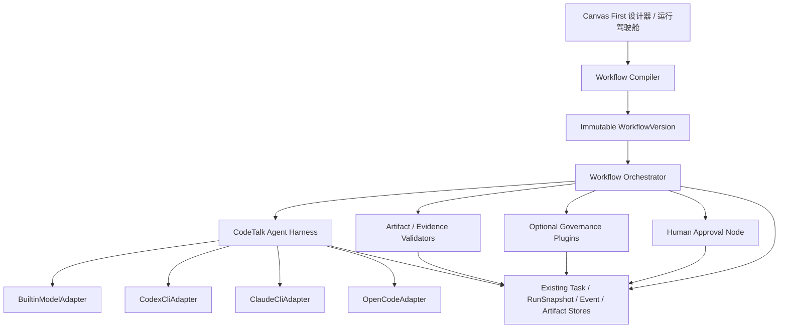
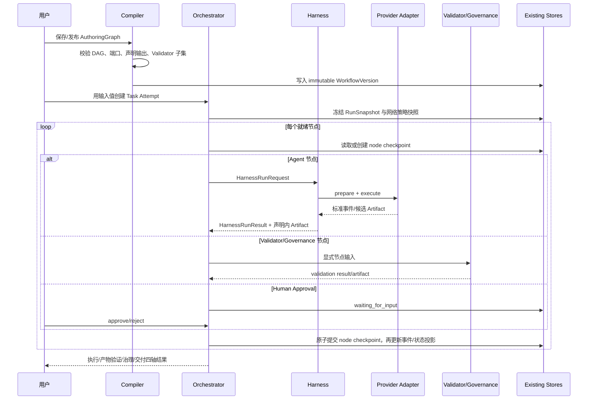
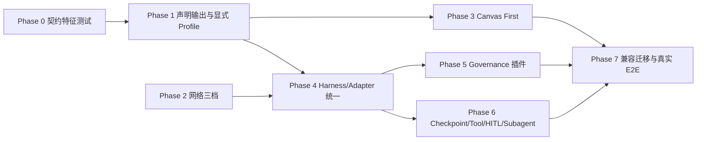

---
feature_ids:
  - harness-workflow-refactor
topics:
  - target-architecture
  - workflow-contract
  - harness
  - governance-plugins
  - canvas-first
  - migration
doc_kind: target-architecture
created: 2026-07-27
---

# CodeTalk Harness 与工作流目标架构

## 1. 架构原则

本架构受 `harness-workflow-goal.md` 约束，按以下原则裁决所有实现选择：

1. **声明即权威**：编译后的输入、输出和 Validator 是一次运行的唯一契约。
2. **执行与治理分离**：Harness 不知道业务领域；专业规则只能存在于显式插件节点。
3. **单一真相源**：沿用 WorkflowVersion、Task/Attempt、RunSnapshot、Event Store 和 Artifact Store。
4. **适配器要薄**：Provider Adapter 只解决执行器差异，不管理工作流状态。
5. **画布优先**：用户先编辑可见节点与连线，技术 ID 和 JSON 默认隐藏。
6. **内网可运行**：默认 `intranet` 允许管理员批准的模型网关、代理和 CA，同时禁止遥测、更新和 Hosted MCP。
7. **历史不可改写**：旧版本按冻结语义读取，新版本走新契约；不批量重写历史快照。

## 2. 目标分层



依赖方向只能向下。Harness、Adapter 和基础 Validator 不得导入 Storage Test Governance 包。

## 3. 模块边界

### 3.1 Workflow Authoring

职责：

- 节点创建、删除、移动与连接；
- label、输入类型、Provider、Prompt、超时和输出文件名编辑；
- 自动生成并保持稳定内部 ID；
- 客户端即时端口校验；
- 保存草稿、试运行、发布。

不负责：

- 执行 Agent；
- 推断专业治理；
- 生成运行时 Test Activity Contract；
- 修改历史发布版本。

### 3.2 Workflow Compiler

职责：

- 校验 DAG、端口类型和单值端口占用；
- 解析输入绑定和依赖；
- 冻结声明输出；
- 展开用户显式选择的 Validation Profile；
- 校验 Validator 依赖的 Artifact 是声明输出子集；
- 生成不可变运行计划。

编译器不得根据工作流名称、Prompt、目标文本或文件名猜测 Profile。

### 3.3 Workflow Orchestrator

职责：

- 按编译计划调度节点；
- 管理节点状态、超时、重试、取消和失败策略；
- 保存节点 Checkpoint；
- 恢复未完成节点并复用已成功节点；
- 分发 Agent、Validator、Tool、HITL 和 Subagent 节点；
- 聚合执行、产物验证、治理和交付四类状态。

不负责：

- Provider 命令差异；
- SFMEA、iSCSI、黑盒测试等专业判断；
- 自己创建第二套任务或 Artifact Store。

### 3.4 CodeTalk Agent Harness

职责：

- 将冻结输入传给 Adapter；
- 建立受控工作目录和 Artifact 目录；
- 标准化流式事件；
- 实施总超时、Idle timeout 与取消；
- 调用通用 Tool Call；
- 创建可追踪的子 Agent session；
- 收集 Adapter 候选 Artifact，并按声明集合收窄；
- 返回 Provider 中立结果。

禁止导入或出现：协议事实、SFMEA/RPN、黑盒用例规则、固定文件数量、特定仓库目录。

### 3.5 Provider Adapters

生产 Adapter 固定为：

- `BuiltinModelAdapter`
- `CodexCliAdapter`
- `ClaudeCliAdapter`
- `OpenCodeAdapter`

每个 Adapter 只实现启动、Prompt 传输、事件解析、取消、能力声明和 Artifact 候选收集。CLI 会话 ID 可以保存为节点 checkpoint 的 Provider 元数据，但不能成为 CodeTalk 的任务真相源。

### 3.6 Artifact / Evidence Validators

核心 Validator 分为：

- `ArtifactExistsValidator`：路径边界、存在、非空、类型；
- `JsonSchemaValidator`：JSON 解析与用户声明 Schema；
- `SourceEvidenceValidator`：路径、行号、Quote、SHA256；

其中只有 Artifact Exists 属于默认 `artifact_only`。其他 Validator 必须来自显式 Profile 或画布节点。

### 3.7 Governance Plugins

第一批专业插件：

- `storage_test_design`
- `sfmea`
- `black_box_cases`
- `independent_review`

插件拥有自己的 Prompt、Schema、规则和修复策略，但必须分成两种节点语义：

- `governance` 是生成/转换节点，拥有普通输入和输出端口；它产生的每个用户交付 Artifact 必须预先声明，并将自身记录为唯一 producer。
- `validator` 是只读验收节点，只消费 `required_outputs`，返回结构化 `ValidationResult`；它不能产生新的用户交付 Artifact。诊断文件只能写入节点私有诊断目录，不能进入声明输出。

两类节点都不得修改 Harness 或隐式向工作流增加输出。需要生成独立审查报告时，应使用有显式输出端口的 `governance` 节点，再由 `validator` 验收该报告。

## 4. 运行流程



## 5. 目标数据模型

### 5.1 AuthoringGraphV3

新草稿使用 `schema_version: 3`。历史 V1/V2 已发布版本保持只读；现存 V1/V2 草稿继续使用 legacy editor，只有用户显式复制时才生成 V3 草稿，不原地升级。

```json
{
  "schema_version": 3,
  "workflow_id": "wf_01J...",
  "name": "自由源码分析",
  "description": "",
  "nodes": [],
  "edges": [],
  "settings": {
    "validation_profile": "artifact_only",
    "stop_on_error": true,
    "max_parallelism": 1
  }
}
```

`workflow_id`、node ID、port ID、step ID、contract ID 和 output ID 由系统生成。label 可改，内部 ID 不随 label 改变。

### 5.2 节点公共模型

```json
{
  "id": "agent_01",
  "kind": "agent",
  "label": "分析源码",
  "position": {"x": 420, "y": 180},
  "ports": {
    "inputs": [
      {"id": "repo", "type": "directory", "required": true, "collection": false}
    ],
    "outputs": [
      {"id": "result", "type": "artifact_set", "required": true, "collection": true}
    ]
  },
  "config": {
    "provider_ref": "provider_codex_default",
    "goal": "分析用户指定目标并生成声明报告",
    "timeout_sec": 1200,
    "idle_timeout_sec": 180
  }
}
```

普通 UI 只显示 label、类型和业务配置。内部 ID 仅在“高级/诊断”中只读展示。

### 5.3 声明输出

```json
{
  "output_id": "output_01",
  "label": "分析报告",
  "artifact": "report.md",
  "media_type": "text/markdown",
  "required": true,
  "schema": null,
  "producer_step_id": "agent_01"
}
```

`declared_outputs` 是所有基础验证和专业治理的上界。运行准备阶段不能追加其他输出。

### 5.4 Validator 节点

```json
{
  "id": "validator_01",
  "kind": "validator",
  "config": {
    "validator_type": "source_evidence",
    "required_outputs": ["output_01"],
    "blocking": true
  }
}
```

编译不变量：

```text
validator.required_outputs ⊆ workflow.declared_outputs
```

违反时不能发布或试运行，错误直接定位 Validator 与缺失的声明输出。

生成型 Governance 节点使用普通端口与边：

```json
{
  "id": "governance_01",
  "kind": "governance",
  "config": {"handler_id": "storage_test_design", "handler_version": 1},
  "ports": {
    "inputs": [{"id": "source_report", "type": "artifact", "required": true}],
    "outputs": [{"id": "sfmea", "type": "artifact", "required": true}]
  }
}
```

若 `sfmea` 端口连接到 `sfmea.json` 输出，则 `sfmea.json.producer_step_id` 必须等于 `governance_01`。没有连接和声明输出时，编译器不允许 handler 自行生成该文件。

### 5.5 Validation Profile

Profile 是画布快捷配置，不是运行时猜测器：

| Profile | 编译行为 |
|---|---|
| `none` | 不注入基础 Validator |
| `artifact_only` | 对每个 required 输出生成 ArtifactExists 校验 |
| `schema` | 在 artifact_only 上增加声明 Schema 校验 |
| `source_evidence` | 增加用户显式配置的源码证据校验 |
| `storage_test_design` | 展开为可见的专业治理节点组合 |
| `formal_release` | 增加独立 Reviewer 与 Human Approval |

Profile 展开后的 Validator 必须写入编译计划并在 UI 中可见。用户发布前能看到“将执行哪些验收”，不能隐藏注入。

### 5.6 CompiledWorkflowContractV3

```json
{
  "compiled_contract_version": 3,
  "workflow_version_id": "wfv_...",
  "validation_profile": "artifact_only",
  "declared_inputs": [
    {"input_id": "input_01", "label": "源码工作区", "type": "directory", "required": true},
    {"input_id": "input_02", "label": "分析目标", "type": "text", "required": true}
  ],
  "declared_outputs": [],
  "nodes": [
    {
      "node_id": "agent_01",
      "graph_node_id": "node_...",
      "kind": "agent",
      "handler_id": "agent",
      "handler_version": 1,
      "depends_on": [],
      "resolved_input_bindings": {
        "repo": {"source_node_id": "input_01", "source_port_id": "value"},
        "analysis_target": {"source_node_id": "input_02", "source_port_id": "value"}
      },
      "input_ports": [
        {"id": "repo", "type": "directory", "required": true},
        {"id": "analysis_target", "type": "text", "required": true}
      ],
      "output_ports": [],
      "provider_ref": "provider_codex_default",
      "provider_capabilities_required": ["streaming", "cancellation"],
      "mcp_profiles": [],
      "skill_ids": [],
      "skill_instructions": [],
      "goal": "分析用户指定目标并生成声明报告",
      "prompt_template_version": 1,
      "prompt_template": "{{node_goal}}\n\n{{bound_inputs}}\n\n{{output_contract}}",
      "input_rendering": {
        "preserve_user_text_verbatim": true,
        "binding_order": ["repo", "analysis_target"]
      },
      "timeout_sec": 1200,
      "idle_timeout_sec": 180,
      "retry_policy": {"max_attempts": 1, "backoff_seconds": 0},
      "failure_policy": "stop",
      "required_outputs": ["output_01"]
    }
  ],
  "topological_order": ["agent_01"],
  "stop_on_error": true,
  "max_parallelism": 1
}
```

`nodes` 同时容纳 agent、builtin model、tool、governance、validator 与 human approval 节点。每个节点必须冻结 handler/version、依赖、bindings、端口、Provider 能力、MCP、Skills、skill instructions、goal、Prompt 模板及版本、输入渲染规则、超时、重试、失败策略和声明输出关系；运行时不得回读可变草稿或当前 Registry 补字段。WorkflowVersion 冻结渲染规则，RunSnapshot 冻结本次用户输入；渲染器必须按绑定顺序逐字保留用户文本，不得以换行、空白或 JSON 重序列化截断内容。

运行器只读此对象，不再调用 `default_test_activity_stage_specs()`、`default_artifact_contract_v3()` 或目标文本推断函数。缺少 `compiled_contract_version` 的冻结定义确定性进入 legacy compatibility runner；任何未知版本 fail closed，不猜测升级。

### 5.7 NodeCheckpoint

Checkpoint 作为现有 Attempt Artifact 目录的一部分保存，不修改 immutable RunSnapshot，也不新增数据库或状态服务。每个节点的 `checkpoints/<node_id>.json` 是该节点恢复状态的唯一权威：

```json
{
  "checkpoint_version": 1,
  "task_id": "task_...",
  "attempt_id": "attempt_...",
  "node_id": "agent_01",
  "revision": 3,
  "idempotency_key": "sha256:workflow-node-input-upstream",
  "status": "completed",
  "input_hash": "sha256:...",
  "output_artifact_hashes": {},
  "provider_session": {"provider": "codex", "session_id": "..."},
  "completed_at": "..."
}
```

提交协议：

1. 节点输出先写入 Attempt 下的临时节点目录；
2. 验证完成后计算 Artifact hash，并原子 rename 到节点正式目录；
3. 使用同目录临时文件、`fsync` 和原子 replace 提交递增 revision 的 checkpoint；此时节点完成正式生效；
4. checkpoint 提交后再追加带 `checkpoint:<node_id>:<revision>` 去重键的展示事件并更新 `task_run.json` 投影；若进程在两者之间崩溃，启动协调器从 checkpoint 幂等重建缺失事件与投影；
5. 未提交 checkpoint 的临时输出一律忽略并清理，节点按 idempotency key 重试；
6. 事件 JSONL 和 `task_run.json` 是可重建投影，不是 checkpoint 真相源。

仅当节点定义、冻结输入和上游 Artifact hash 共同计算出的 idempotency key 一致时允许复用。单节点 checkpoint 写入由 Attempt 级文件锁串行化；重复提交相同 key/revision 幂等，旧 revision 不得覆盖新 revision。

## 6. Provider 与 Harness 接口

目标接口是同步/异步实现无关的语义协议：

```python
class ProviderAdapter(Protocol):
    def capabilities(self) -> ProviderCapabilities: ...
    def prepare(self, request: HarnessRunRequest) -> ProviderSession: ...
    def execute(self, session, callbacks) -> HarnessRunResult: ...
    def resume(self, session, resume_from: ProviderResumeToken, callbacks) -> HarnessRunResult: ...
    def cancel(self, session) -> CancelResult: ...
    def collect_artifacts(self, session) -> list[ArtifactCandidate]: ...
```

`ProviderCapabilities` 至少声明：streaming、tool_call、session_resume、structured_output、mcp、skills 和 cancellation。`session_resume=false` 时 `resume()` 必须返回结构化 unsupported 结果，Orchestrator 根据 node checkpoint 重新 `prepare()`，不能假装续接成功。

Orchestrator 根据能力决定是否允许相应节点发布；Adapter 不能静默忽略不支持能力。

内置模型必须通过 `BuiltinModelAdapter` 进入同一 Facade。迁移采用包装现有 `_execute_builtin_llm_step()` 的方式，先统一契约和事件，再移动实现，避免一次重写模型调用路径。

## 7. Tool Call、Subagent 与 HITL

### Tool Call

- Tool 注册来自 CodeTalk 管理的本地 MCP/工具目录。
- Harness 发出 `tool_requested` 事件，由 Orchestrator 校验工具 ID、参数 Schema 和权限。
- 执行结果写入现有事件与 Artifact Store，再返回 Harness。
- Provider 不可绕过 Orchestrator 自行改变任务状态。

### Subagent

- 子 Agent 是父节点下的 child session，不是新 Workflow Task。
- 每个 child session 有独立 session ID、Provider、输入摘要、事件和 Artifact 子目录。
- 父节点 checkpoint 记录 child session 状态；最终只收集声明输出。

### Human-in-the-loop

- Human Approval 是显式节点。
- 节点进入 `waiting_for_input`，任务不是 failed/blocked。
- 用户 approve/reject 后追加不可变事件，并从该节点继续。
- 等待期间总执行超时暂停，但审批期限可单独配置。

## 8. 状态模型

```text
execution_status:
  queued | running | waiting_for_input | completed | failed | cancelled | timed_out

artifact_validation_status:
  not_requested | not_started | running | passed | failed

governance_status:
  not_requested | running | passed | warning | failed | waived

delivery_status:
  pending | ready | blocked
```

前三轴由各自节点状态归约，`delivery_status` 只允许按以下优先级纯函数派生，命中即返回：

1. execution 为 `queued/running/waiting_for_input` -> `pending`；
2. execution 为 `failed/cancelled/timed_out` -> `blocked`；
3. execution=`completed` 且 artifact validation 为 `not_started/running` -> `pending`；
4. execution=`completed` 且 artifact validation=`failed` -> `blocked`；
5. execution=`completed` 且 artifact validation 为 `passed/not_requested`，governance=`running` -> `pending`；
6. 同上，任一 blocking governance 节点失败 -> governance=`failed`，delivery=`blocked`；
7. 同上，只有 non-blocking governance 节点失败 -> governance=`warning`，delivery=`ready`；
8. 同上，governance 为 `passed/not_requested/waived/warning` -> `ready`。

execution=`completed` 时 governance 不允许处于未定义的空值；没有治理节点必须归约为 `not_requested`。

`waived` 必须来自显式 Human Approval 事件，记录 actor、原因、目标 validator 和时间；不能由 Runner 自动设置。非法状态组合在写入投影时拒绝，并可由 checkpoint 与事件重建。

示例：

- Agent 成功但 `report.md` 缺失：execution=completed，artifact_validation=failed，delivery=blocked。
- `artifact_only` 工作流没有专业节点：governance=not_requested，而不是 failed。
- 专业 Validator 失败：存在 blocking 失败时 governance=failed、delivery=blocked；只有 non-blocking 失败时 governance=warning、delivery=ready。
- Provider 启动失败：execution=failed，其他状态不伪装成质量失败。

## 9. 网络策略

网络模式是部署级管理员设置，不是普通工作流节点属性。

### developer

- 允许配置的 Base URL、localhost 和管理员代理；
- 不要求 OS network namespace；
- 仍禁用 telemetry、tracing、自动更新与 Hosted MCP；
- 记录目标主机摘要。

### intranet（默认）

- 只注入已批准的模型 Base URL、代理、NO_PROXY 和 CA bundle；
- CLI Agent 可访问批准网关；
- 文件系统沙箱开启；
- 网络型 CLI Agent 必须选择一种管理员声明的强制边界：`approved_proxy_gateway` 或 `deployment_egress_policy`；没有强制边界时，preflight 只阻断需要联网的 CLI Adapter，并明确提示配置网关，不影响内置模型和离线 Agent；
- `approved_proxy_gateway` 模式只注入批准代理/CA，同时要求部署防火墙阻止进程绕过代理直连；`deployment_egress_policy` 模式由部署侧策略只放行批准目标，CodeTalk 保存策略 ID 和探测证据；
- 仅设置环境变量不视为完成出站限制，发布验收必须包含 CLI 尝试访问未批准测试目的地并被真实拒绝的负向证据；
- 不要求部署前先实现全量抓包。

### strict_compliance

- 默认断网、OS 级隔离和 fail-closed；
- 仅通过精细出口网关；
- 网络模式不得注入 Independent Reviewer、HITL 或其他专业治理；若管理员制度要求审批，只能在发布策略中要求工作流作者显式连接对应节点；
- 只能管理员显式启用。

旧 `intranet_network_mode=true` 迁移为 `intranet`；旧的 host-enforced 配置存在且为真时可映射到 `strict_compliance`，但迁移前必须在设置页展示确认，不静默改变运行能力。

## 10. Canvas First 产品结构

### 路由

- `/workflows/new?template=blank`：服务端生成工作流与稳定 ID，立即跳转 `/workflows/{id}/designer`。
- `/workbench/designer`：直接打开最近草稿或模板选择，不再重定向列表。
- 模板选择是轻量弹层，不是向导。

### 页面布局

- 顶部：名称、保存、试运行、发布。
- 左侧：可搜索、可分组的节点库。
- 中间：XYFlow 画布。
- 右侧：选中节点时展开属性，点击空白收回。
- 高级诊断：默认折叠，包含只读内部 ID、编译 JSON 和接口诊断。

### 加载协议

工作流详情、workflow capabilities、provider capabilities、node registry 独立加载。每项状态包含：

```text
idle | loading | ready | failed(endpoint, status, message, retryable)
```

某项失败时显示具体 endpoint、HTTP 状态、前后端 commit SHA 和独立重试。不得用一个 `Promise.all` 让无关成功结果一起丢失。

### 运行表单

试运行/驾驶舱严格按输入节点生成表单。用户看到 label、提示、类型和必填状态；表单提交保留原始文本与文件绑定，不要求 contract ID。

## 11. 历史兼容与迁移

### 不变项

- 历史已发布 WorkflowVersion 原文、compiled definition 和版本号不变。
- 历史 RunSnapshot、任务、事件和 Artifact 不变。
- 旧任务继续走冻结的 legacy runtime adapter，只读展示原有质量结果。
- 缺少 `compiled_contract_version` 的定义一律按 legacy 读取；未知非空版本拒绝运行。

### 新增项

- 新草稿默认 AuthoringGraphV3。
- 新发布版本写入 CompiledWorkflowContractV3。
- 新 Task RunSnapshot 冻结 `compiled_contract_version`、`validation_profile` 和 network policy snapshot。

### Legacy 工作流

- 旧 `basic_source_report_codex`、`basic_source_design_report_builtin` 不改 ID、不改历史内容。
- 通过独立的 preset presentation metadata 将列表显示为“Legacy · SPDK iSCSI …”，不得修改同 ID canonical definition 或触发 builtin bootstrap 重建发布版本。
- 新增真正通用模板使用新 ID，不写死仓库、协议、目录或数量。
- 用户复制 Legacy 工作流时生成 V3 草稿，由迁移预览明确列出仍启用的专业规则。
- 历史 V1/V2 已发布版本只读；现存 V1/V2 草稿可继续用 legacy editor 编辑，也可以由用户显式“复制为 V3”，但不原地自动迁移。

### 双运行路径退役

迁移期仅允许按冻结版本选择：

- legacy snapshot -> legacy compatibility runner；
- V3 compiled contract -> new orchestrator path。

不允许同一 Attempt 同时运行两条路径，也不允许运行时自动把旧快照升级为 V3。

## 12. 阶段依赖



Phase 1 是功能重构的必经起点。Phase 2 可与 Phase 1 独立提交，但必须在真实 Provider E2E 前完成。Canvas、Harness 和 Governance 不应塞进一个大提交。

## 13. 目标追踪

| 目标验收 | 架构实现点 |
|---|---|
| AC-01/02/03 | Canvas First、自动稳定 ID、Validator/HITL 节点 |
| AC-04/05/06 | declared_outputs、默认 artifact_only、显式 Profile |
| AC-07 | Harness 禁止领域导入，Governance Plugin 边界 |
| AC-08 | 依赖门禁，不引入大厂 SDK |
| AC-09 | 四个薄 Adapter 与统一 Facade |
| AC-10 | 三档网络与批准代理/CA |
| AC-11 | NodeCheckpoint、取消、超时、恢复、HITL |
| AC-12 | 通用与专业真实浏览器/内网 E2E |
| AC-13 | 冻结旧版本、legacy adapter、新版本增量写入 |
| AC-14 | 四轴状态模型 |

## 14. 架构决策门禁

开始实现前需要确认以下决策：

1. 新草稿采用 AuthoringGraphV3，历史 V1/V2 不原地升级。
2. `validation_profile` 是显式编译配置；Profile 展开结果在画布/发布预览中可见。
3. `declared_outputs` 是唯一验收上界，任务准备阶段无权追加产物。
4. 专业测试代码迁为插件，不删除能力、不保留核心导入。
5. 内置模型也必须通过 Provider Adapter。
6. 网络模式是管理员部署策略，默认 intranet，不由工作流随意降级。
7. Checkpoint 以 Attempt Artifact 目录中的原子记录为唯一权威；RunSnapshot 只冻结输入，Event/task_run 是可重建投影。

这七项获确认后，才进入分阶段实现。
